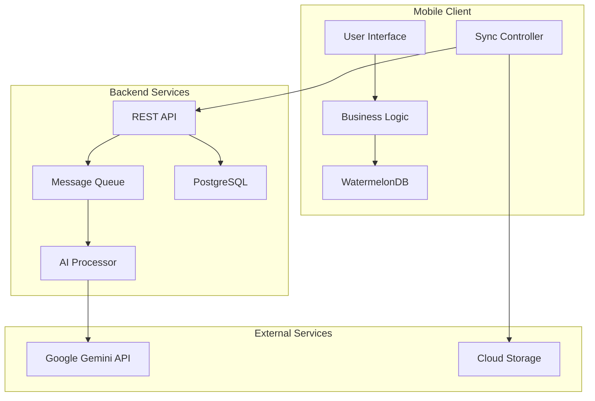

# UNIVERSITAS SIBER ASIA

\*\*RANCANG BANGUN APLIKASI KEUANGAN PRIBADI "BRAINFIN" BERBASIS REACT NATIVE DENGAN INTEGRASI GOOGLE GEMINI API S### 4.7 Arsitektur Sistem dan Tumpukan Teknologi

Implementasi teknologi yang komprehensif ini memastikan bahwa aplikasi BrainFIN dibangun dengan fondasi yang kuat, aman, dan dapat diskalakan, sambil tetap mempertahankan performa tinggi dan pengalaman pengguna yang optimal.BAGAI ASISTEN KEUANGAN CERDAS\*\*

Diajukan sebagai salah satu syarat untuk memperoleh gelar Sarjana Komputer

Oleh :

Haris Wahyudi  
220401010015

**PROGRAM STUDI INFORMATIKA  
FAKULTAS TEKNOLOGI INFORMASI  
JANUARI 2024**

## PERNYATAAN ORISINALITAS

Saya yang bertanda tangan di bawah ini:

**Nama** : Haris Wahyudi  
**NIM** : 220401010015  
**Program Studi** : Informatika  
**Judul** : Rancang Bangun Aplikasi Keuangan Pribadi "BrainFIN" Berbasis React Native dengan Integrasi Google Gemini API sebagai Asisten Keuangan Cerdas

Menyatakan dengan sesungguhnya bahwa Tugas Akhir ini merupakan hasil penelitian, pemikiran, dan pemaparan asli saya sendiri. Saya tidak mencantumkan tanpa pengakuan bahan-bahan yang telah dipublikasikan sebelumnya atau ditulis oleh orang lain, atau sebagai bahan yang pernah diajukan untuk gelar atau ijazah pada Universitas Siber Asia atau perguruan tinggi lainnya. Apabila di kemudian hari terdapat penyimpangan dan ketidakbenaran dalam pernyataan ini, maka saya bersedia menerima sanksi akademik sesuai dengan peraturan yang berlaku di Universitas Siber Asia.

Demikian pernyataan ini saya buat.

Jakarta, 29/3/2024

Yang membuat pernyataan,

**Haris Wahyudi**

---

## LEMBAR PENGESAHAN

**Nama** : Haris Wahyudi  
**NIM** : 220401010015  
**Program Studi** : Informatika  
**Judul** : Rancang Bangun Aplikasi Keuangan Pribadi "BrainFIN" Berbasis React Native dengan Integrasi Google Gemini API sebagai Asisten Keuangan Cerdas

Telah berhasil dipertahankan di hadapan Dewan Penguji dan diterima sebagai bagian persyaratan yang diperlukan untuk memperoleh gelar Sarjana pada Program Studi Informatika Universitas Siber Asia.

**DEWAN PENGUJI**

**Ketua Sidang/Penguji I**  
Dr. Ucuk Darusalam, S.T., M.T  
..............................

**Penguji II**  
Vika Febri Muliati, S.Kom., M.Kom  
..............................

**Pembimbing I**  
Fesa Asy Syifa Nurul Haq, S.Kom., MMSI  
..............................

**Pembimbing II**  
Kurniati Asmar, S.Kom., M.Kom  
..............................

Ditetapkan di : Jakarta  
Tanggal : 18/4/2024

---

## KATA PENGANTAR

Puji syukur saya panjatkan kepada Tuhan Yang Maha Esa, karena atas berkat dan rahmat-Nya, saya dapat menyelesaikan Tugas Akhir ini. Penulisan Tugas Akhir ini dilakukan dalam rangka memenuhi salah satu syarat untuk mencapai gelar Sarjana Program Studi Informatika Universitas Siber Asia.

Ketertarikan penulis dengan permasalahan dalam Tugas Akhir ini adalah **RANCANG BANGUN APLIKASI KEUANGAN PRIBADI "BRAINFIN" BERBASIS REACT NATIVE DENGAN INTEGRASI GOOGLE GEMINI API SEBAGAI ASISTEN KEUANGAN CERDAS**.

Saya menyadari bahwa, tanpa bantuan dan bimbingan dari berbagai pihak, dari masa perkuliahan sampai pada penyusunan Tugas Akhir ini, sangatlah sulit bagi saya untuk menyelesaikan Tugas Akhir ini. Oleh karena itu, saya mengucapkan terima kasih kepada:

1. Bapak Prof, Jang Youn Cho, Ph.D., CPA. Selaku Rektor Universitas Siber Asia.
2. Bapak Dr. Ucuk Darusalam, S.T., M.T. Selaku Wakil Rektor Bidang Akademik, Penelitian dan Pengabdian Kepada Masyarakat Universitas Siber Asia.
3. Ibu Vika Febri Muliati, S.Kom., M.Kom. Selaku Kaprodi Informatika Universitas Siber Asia.
4. Ibu Fesa Asy Syifa Nurul Haq, S.Kom., MMSI. Selaku Dosen Pembimbing I yang telah menyediakan waktu, tenaga, dan pikiran untuk mengarahkan saya dalam penyusunan Tugas Akhir ini.
5. Ibu Kurniati Asmar, S.Kom., M.Kom. Selaku Dosen Pembimbing II yang telah menyediakan waktu, tenaga, dan pikiran untuk mengarahkan saya dalam penyusunan Tugas Akhir ini.
6. Kedua orang tua, istri, dan anak yang senantiasa memberikan dukungan, semangat, juga doa yang tidak pernah putus untuk penulis.

Penulis menyadari bahwa masih terdapat kekurangan dan kelemahan. Untuk itu, penulis sangat mengharapkan kritik serta saran yang sifatnya membangun.

Jakarta, 12 Juli 2024

**Haris Wahyudi**

---

## DAFTAR ISI

**HALAMAN JUDUL** .................................................................................... i  
**LEMBAR PENGESAHAN** .......................................................................... ii  
**PERNYATAAN ORISINALITAS** ................................................................. iii  
**KATA PENGANTAR** ................................................................................ iv  
**DAFTAR ISI** ........................................................................................... v  
**DAFTAR TABEL** ..................................................................................... vi  
**DAFTAR GAMBAR** .................................................................................. vii  
**DAFTAR LAMPIRAN** ............................................................................... viii  
**ABSTRAK** .............................................................................................. ix  
**ABSTRACT** ........................................................................................... x

**BAB I PENDAHULUAN** ........................................................................... 1  
1.1 Latar Belakang ....................................................................................... 1  
1.2 Rumusan Masalah .................................................................................. 3  
1.3 Tujuan Penelitian ................................................................................... 4  
1.4 Manfaat Penelitian ................................................................................. 4  
1.5 Batasan Masalah .................................................................................... 5  
1.6 Sistematika Penulisan ............................................................................ 6

**BAB II LANDASAN TEORI** ..................................................................... 7  
2.1 Aplikasi Keuangan Pribadi ..................................................................... 7  
2.2 Framework React Native ........................................................................ 9  
2.3 Google Gemini API dan Large Language Model ...................................... 12  
2.4 Pengembangan Aplikasi Mobile .............................................................. 15  
2.5 User Experience Design untuk Aplikasi Finansial ................................... 17  
2.6 Database dan Penyimpanan Lokal .......................................................... 19  
2.7 Visualisasi Data Keuangan ..................................................................... 21

**BAB III METODOLOGI PENELITIAN** ...................................................... 23  
3.1 Metode Pengembangan Sistem .............................................................. 23  
3.2 Analisis Kebutuhan ................................................................................ 25  
3.3 Desain Sistem dan Arsitektur ................................................................. 27  
3.4 Tools dan Teknologi .............................................................................. 29  
3.5 Metode Pengumpulan Data dan Pengujian ............................................. 31  
3.6 Lokasi dan Waktu Penelitian .................................................................. 33

**BAB IV ANALISIS DAN PERANCANGAN SISTEM** ................................... 34  
4.1 Analisis Kebutuhan Fungsional .............................................................. 34  
4.2 Analisis Kebutuhan Non-Fungsional ....................................................... 38  
4.3 Use Case Diagram ................................................................................. 40  
4.4 Entity Relationship Diagram ................................................................... 42  
4.5 Flowchart Sistem .................................................................................. 44  
4.6 Perancangan User Interface ................................................................... 46  
4.7 Arsitektur Sistem .................................................................................. 48

**BAB V IMPLEMENTASI DAN PENGUJIAN** .............................................. 50  
5.1 Implementasi Sistem ............................................................................. 50  
5.2 Integrasi Google Gemini API .................................................................. 55  
5.3 Pengujian Sistem .................................................................................. 58  
5.4 Evaluasi dan Analisis Hasil .................................................................... 62

**BAB VI PENUTUP** ................................................................................. 64  
6.1 Kesimpulan ........................................................................................... 64  
6.2 Saran ................................................................................................... 65

**DAFTAR PUSTAKA** ............................................................................... 66  
**LAMPIRAN** ........................................................................................... 67  
1.1 Latar Belakang ....................................................................................... 1  
1.2 Rumusan Masalah .................................................................................. 3  
1.3 Tujuan Penelitian ................................................................................... 4  
1.4 Manfaat Penelitian ................................................................................. 4  
1.5 Batasan Masalah .................................................................................... 5  
1.6 Sistematika Penulisan ............................................................................ 6

**BAB II LANDASAN TEORI** ..................................................................... 7  
2.1 Aplikasi Keuangan Pribadi ..................................................................... 7  
2.2 Framework React Native ........................................................................ 9  
2.3 Google Gemini API dan Large Language Model ...................................... 12  
2.4 Pengembangan Aplikasi Mobile .............................................................. 15  
2.5 User Experience Design untuk Aplikasi Finansial ................................... 17  
2.6 Database dan Penyimpanan Lokal .......................................................... 19  
2.7 Visualisasi Data Keuangan ..................................................................... 21

**BAB III METODOLOGI PENELITIAN** ...................................................... 23  
3.1 Metode Pengembangan Sistem .............................................................. 23  
3.2 Analisis Kebutuhan ................................................................................ 25  
3.3 Desain Sistem dan Arsitektur ................................................................. 27  
3.4 Tools dan Teknologi .............................................................................. 29  
3.5 Metode Pengumpulan Data dan Pengujian ............................................. 31  
3.6 Lokasi dan Waktu Penelitian .................................................................. 33

**BAB IV ANALISIS DAN PERANCANGAN SISTEM** ................................... 34  
4.1 Analisis Kebutuhan Fungsional .............................................................. 34  
4.2 Analisis Kebutuhan Non-Fungsional ....................................................... 38  
4.3 Use Case Diagram ................................................................................. 40  
4.4 Entity Relationship Diagram ................................................................... 42  
4.5 Flowchart Sistem .................................................................................. 44  
4.6 Perancangan User Interface ................................................................... 46  
4.7 Arsitektur Sistem .................................................................................. 48

**BAB V IMPLEMENTASI DAN PENGUJIAN** .............................................. 50  
5.1 Implementasi Sistem ............................................................................. 50  
5.2 Integrasi Google Gemini API .................................................................. 55  
5.3 Pengujian Sistem .................................................................................. 58  
5.4 Evaluasi dan Analisis Hasil .................................................................... 62

**BAB VI PENUTUP** ................................................................................. 64  
6.1 Kesimpulan ........................................................................................... 64  
6.2 Saran ................................................................................................... 65

**DAFTAR PUSTAKA** ............................................................................... 66  
**LAMPIRAN** ........................................................................................... 67

---

## BAB I

## PENDAHULUAN

### 1.1 Latar Belakang

Pengelolaan keuangan pribadi merupakan aspek fundamental dalam kehidupan sehari-hari yang menghadapi tantangan kompleks di era digital. Indonesia mengalami paradoks unik dalam lanskap keuangannya: tingkat akses terhadap layanan keuangan (inklusi) yang relatif tinggi tidak diimbangi dengan pengetahuan masyarakat untuk memanfaatkan layanan tersebut secara efektif (literasi). Kesenjangan ini menciptakan populasi yang rentan terhadap pengambilan keputusan keuangan yang buruk, jeratan utang, dan praktik-praktik predator.

Berdasarkan data Survei Nasional Literasi dan Inklusi Keuangan (SNLIK) yang dilakukan oleh Otoritas Jasa Keuangan (OJK), terdapat kesenjangan signifikan antara tingkat inklusi dan literasi keuangan di Indonesia. Pada tahun 2022, indeks literasi keuangan tercatat sebesar 49,68%, sementara indeks inklusi keuangan mencapai 85,10%, menciptakan selisih sebesar 35,42 poin persentase. Meskipun data terbaru SNLIK 2025 menunjukkan peningkatan literasi menjadi 66,46% dan inklusi 80,51%, kesenjangan masih tetap signifikan dengan selisih 14,05 poin persentase.

Kesenjangan ini memiliki konsekuensi nyata yang mengkhawatirkan, terutama di kalangan generasi muda. Kelompok usia 19-34 tahun, yang memiliki skor literasi relatif tinggi (70,19% untuk 18-25 tahun dan 74,82% untuk 26-35 tahun), justru menjadi kontributor terbesar kredit macet pinjaman daring dengan 57,3% dari total kredit macet pada tahun 2023. Hal ini mengindikasikan adanya kesenjangan kritis antara pengetahuan teoretis dan kompetensi praktis dalam pengelolaan keuangan.

Disparitas literasi juga terlihat jelas antarsektor keuangan. Literasi di sektor perbankan mencapai 65,50%, namun anjlok drastis di sektor lain: perasuransian (45,45%), fintech lending (24,90%), dan pasar modal (17,78%). Kondisi ini menunjukkan bahwa "literasi keuangan" di Indonesia secara de facto adalah "literasi perbankan", sementara pemahaman terhadap ekosistem keuangan yang lebih luas masih sangat terbatas.

Di tengah tantangan ini, ekosistem teknologi finansial (fintech) Indonesia menunjukkan pertumbuhan yang luar biasa. Pasar fintech Indonesia dinilai sebesar USD 8,6 miliar pada tahun 2024 dan diproyeksikan mencapai USD 32,5 miliar pada tahun 2032, dengan tingkat pertumbuhan tahunan majemuk (CAGR) sebesar 17,9%. Aplikasi manajemen keuangan pribadi (Personal Finance Management/PFM) muncul sebagai solusi yang menjanjikan untuk menjembatani kesenjangan literasi melalui pendekatan teknologi yang intuitif dan mudah diakses.

Pengembangan aplikasi seluler keuangan pribadi dengan kerangka kerja React Native memungkinkan pembuatan aplikasi lintas platform yang efisien dan hemat biaya. Integrasi dengan Large Language Model (LLM) seperti Google Gemini dapat memberikan wawasan cerdas dan rekomendasi finansial yang personal dan kontekstual, berpotensi mengubah cara masyarakat berinteraksi dengan teknologi keuangan.

**BrainFIN** hadir sebagai respons terhadap kebutuhan mendesak akan solusi yang dapat membantu pengguna, khususnya generasi digital, mengelola keuangan dengan cara yang lebih cerdas, visual, dan mudah dipahami. Aplikasi ini dirancang tidak hanya sebagai alat pencatatan transaksi, tetapi juga sebagai platform edukasi yang dapat meningkatkan literasi keuangan praktis melalui antarmuka yang intuitif dan fitur AI yang memberikan panduan personal.

### 1.2 Rumusan Masalah

Berdasarkan analisis paradoks literasi dan inklusi keuangan di Indonesia, rumusan masalah dalam penelitian ini adalah:

1. Bagaimana merancang dan membangun aplikasi manajemen keuangan pribadi yang dapat menjembatani kesenjangan antara literasi teoretis dan kompetensi praktis dalam pengelolaan keuangan?

2. Bagaimana mengimplementasikan kerangka kerja React Native untuk mengembangkan aplikasi seluler lintas platform yang responsif dan dapat diakses oleh berbagai segmen pengguna?

3. Bagaimana mengintegrasikan Google Gemini API sebagai asisten keuangan cerdas yang mampu memberikan edukasi personal dan rekomendasi finansial yang kontekstual berdasarkan pola pengeluaran pengguna?

4. Bagaimana membangun sistem visualisasi data keuangan yang dapat meningkatkan pemahaman pengguna terhadap kebiasaan finansial mereka dan mendorong perubahan perilaku positif?

5. Bagaimana merancang arsitektur sistem yang mendukung penyimpanan data lokal yang aman dan sinkronisasi awan untuk memastikan aksesibilitas dan keamanan data finansial pengguna?

### 1.3 Tujuan Penelitian

Tujuan dari penelitian ini adalah:

1. Merancang dan mengimplementasikan aplikasi BrainFIN sebagai solusi teknologi untuk mengatasi kesenjangan literasi keuangan praktis melalui pendekatan yang berpusat pada pengguna dan mudah diakses

2. Mengembangkan sistem manajemen keuangan pribadi yang dapat mengubah data transaksi menjadi wawasan yang dapat ditindaklanjuti, membantu pengguna memahami pola keuangan mereka secara mendalam

3. Membangun platform edukasi keuangan interaktif yang mengintegrasikan fitur perencanaan anggaran, visualisasi data, dan analisis pengeluaran untuk meningkatkan kompetensi keuangan praktis

4. Mengintegrasikan teknologi kecerdasan buatan melalui Google Gemini API untuk memberikan bimbingan keuangan yang dipersonalisasi, analisis pola pengeluaran, dan rekomendasi yang kontekstual berdasarkan perilaku keuangan individual

5. Menciptakan aplikasi seluler lintas platform yang dapat berkontribusi pada peningkatan literasi keuangan di Indonesia, khususnya dalam mengatasi kesenjangan pemahaman terhadap produk keuangan di luar sektor perbankan tradisional

### 1.4 Manfaat Penelitian

### 1.4 Manfaat Penelitian

#### 1.4.1 Manfaat Teoritis

1. **Kontribusi dalam bidang teknologi finansial**: Memberikan referensi implementasi aplikasi manajemen keuangan pribadi berbasis AI yang dapat menjembatani kesenjangan literasi dan inklusi keuangan

2. **Eksplorasi konvergensi teknologi**: Menunjukkan sinergi antara teknologi seluler, kecerdasan buatan, dan prinsip-prinsip edukasi keuangan dalam menciptakan solusi yang berdampak sosial

3. **Pengembangan metodologi desain berpusat pada pengguna**: Menyediakan kerangka kerja untuk merancang aplikasi keuangan yang tidak hanya fungsional tetapi juga edukatif dan dapat mengubah perilaku

4. **Kontribusi dalam bidang penelitian fintech Indonesia**: Mengisi kesenjangan penelitian tentang efektivitas aplikasi PFM dalam meningkatkan literasi keuangan praktis di konteks Indonesia

#### 1.4.2 Manfaat Praktis

1. **Untuk Masyarakat Umum**: Menyediakan alat digital yang dapat membantu mengatasi kesenjangan antara akses produk keuangan dan pemahaman cara menggunakannya secara efektif

2. **Untuk Generasi Muda**: Memberikan platform yang dapat membantu kelompok usia 19-34 tahun menghindari jebatan kredit macet pinjaman daring melalui edukasi dan manajemen keuangan yang lebih baik

3. **Untuk Pengembang dan Pelaku Industri Fintech**: Memberikan model referensi pengembangan aplikasi keuangan yang mengutamakan literasi dan pemberdayaan pengguna, bukan hanya akuisisi dan retensi

4. **Untuk Pembuat Kebijakan**: Menyediakan wawasan tentang bagaimana teknologi dapat digunakan sebagai alat pendukung program literasi keuangan nasional dan strategi inklusi keuangan yang lebih efektif

### 1.5 Batasan Masalah

Untuk memfokuskan penelitian dan mengoptimalkan hasil yang dicapai, ditetapkan batasan masalah sebagai berikut:

1. **Ruang Lingkup Pengguna**: Aplikasi difokuskan pada segmen generasi muda urban (usia 18-35 tahun) yang memiliki akses smartphone dan internet, mengingat kelompok ini menunjukkan paradoks literasi tinggi namun rentan terhadap kredit macet

2. **Cakupan Fitur Keuangan**: Aplikasi dibatasi pada manajemen keuangan pribadi dasar (pencatatan transaksi, perencanaan anggaran, visualisasi pengeluaran) dan tidak mencakup fitur investasi kompleks, perdagangan saham, atau integrasi langsung dengan sistem perbankan untuk transaksi

3. **Platform Teknologi**: Pengembangan menggunakan React Native untuk platform Android dan iOS, dengan fokus pada arsitektur yang dapat beroperasi secara luring dengan sinkronisasi awan opsional

4. **Integrasi AI**: Implementasi Google Gemini API dibatasi pada analisis pola pengeluaran, pemberian rekomendasi anggaran personal, dan edukasi keuangan dasar dalam bahasa Indonesia

5. **Aspek Keamanan**: Implementasi keamanan dibatasi pada enkripsi data lokal, autentikasi pengguna basic, dan kepatuhan terhadap prinsip-prinsip privasi data personal tanpa integrasi sistem keamanan perbankan tingkat enterprise

6. **Target Literasi**: Fokus pada peningkatan literasi keuangan praktis khususnya dalam pemahaman produk non-perbankan seperti yang diidentifikasi dalam kesenjangan literasi sektoral SNLIK

7. **Durasi Evaluasi**: Pengujian efektivitas aplikasi dibatasi pada jangka pendek (3-6 bulan) untuk mengukur adopsi dan perubahan perilaku awal, bukan dampak jangka panjang terhadap kesehatan keuangan

### 1.6 Sistematika Penulisan

Sistematika penulisan skripsi ini disusun dalam enam bab dengan rincian sebagai berikut:

**BAB I PENDAHULUAN**  
Bab ini menguraikan latar belakang masalah, rumusan masalah, tujuan penelitian, manfaat penelitian, batasan masalah, dan sistematika penulisan skripsi.

**BAB II LANDASAN TEORI**  
Bab ini membahas teori-teori dan konsep-konsep yang menjadi dasar penelitian, meliputi paradoks literasi dan inklusi keuangan, ekosistem fintech Indonesia, aplikasi manajemen keuangan pribadi, kerangka kerja React Native, teknologi kecerdasan buatan dalam layanan keuangan, dan prinsip-prinsip desain pengalaman pengguna untuk aplikasi edukatif.

**BAB III METODOLOGI PENELITIAN**  
Bab ini menjelaskan metode penelitian yang digunakan, metode pengembangan sistem berbasis user-centered design, analisis kebutuhan pengguna target, desain sistem yang mendukung literasi keuangan, perangkat dan teknologi yang digunakan, serta metode pengumpulan data dan strategi pengujian efektivitas.

**BAB IV ANALISIS DAN PERANCANGAN SISTEM**  
Bab ini menyajikan hasil analisis kebutuhan sistem berdasarkan kesenjangan literasi keuangan yang teridentifikasi, perancangan arsitektur aplikasi yang mendukung edukasi, desain basis data untuk manajemen keuangan pribadi, perancangan antarmuka pengguna yang intuitif dan edukatif, serta spesifikasi integrasi AI untuk personalisasi pembelajaran.

**BAB V IMPLEMENTASI DAN PENGUJIAN**  
Bab ini membahas proses implementasi sistem BrainFIN, integrasi dengan Google Gemini API untuk fitur edukatif, pengujian fungsionalitas dan usability, evaluasi efektivitas dalam meningkatkan pemahaman keuangan pengguna, dan analisis hasil pengujian aplikasi.

**BAB VI PENUTUP**  
Bab ini berisi kesimpulan dari hasil penelitian yang telah dilakukan dan saran-saran untuk pengembangan dan penelitian lebih lanjut.

---

## BAB II

## LANDASAN TEORI

### 2.1 Aplikasi Keuangan Pribadi (Manajemen Keuangan Personal)

### 2.2 Kerangka Kerja React Native untuk Pengembangan Seluler Lintas Platform

### 2.3 Google Gemini API dan Model Bahasa Besar dalam Aplikasi Finansial

### 2.4 Pengembangan Aplikasi Seluler Modern

### 2.5 Desain Pengalaman Pengguna untuk Aplikasi Keuangan

### 2.6 Basis Data Lokal dan Manajemen Data (SQLite/MMKV)

### 2.7 Visualisasi Data Keuangan dan Analitik Dasbor

### 2.8 Analisis Arsitektur Teknis dan Tumpukan Teknologi Modern

#### 2.8.1 Cetak Biru Arsitektur untuk Aplikasi Keuangan Modern

Dalam pengembangan aplikasi keuangan modern seperti BrainFIN, visi sistem berpusat pada dua pilar utama: pengalaman pengguna dengan antarmuka ganda dan ketahanan operasional melalui arsitektur offline-first. Pendekatan antarmuka ganda dirancang untuk melayani dua kasus penggunaan yang berbeda, yaitu antarmuka pengguna grafis (GUI) untuk manajemen keuangan yang mendetail dan antarmuka percakapan (CUI) untuk pencatatan transaksi yang cepat.

Paradigma offline-first ditetapkan sebagai persyaratan non-fungsional inti, di mana aplikasi dirancang untuk berfungsi sepenuhnya tanpa koneksi internet. Operasi fundamental seperti membuat, membaca, memperbarui, dan menghapus (CRUD) transaksi harus dapat dilakukan secara lokal di perangkat pengguna. Sinkronisasi data dengan server pusat diperlakukan sebagai proses sekunder yang terjadi secara oportunistik ketika koneksi tersedia.

#### 2.8.2 Evaluasi Tumpukan Teknologi Sisi Klien

**React Native sebagai Fondasi Pengembangan**

React Native dipilih sebagai kerangka kerja utama karena kemampuannya dalam pengembangan lintas platform yang efisien. Keuntungan utama React Native adalah penggunaan ulang kode yang memungkinkan targeting iOS dan Android dari satu basis kode JavaScript/TypeScript, secara dramatis mengurangi waktu dan biaya pengembangan dibandingkan dengan membangun dua aplikasi native terpisah.

Ekosistem JavaScript dan React yang besar memberikan akses ke kumpulan talenta pengembang yang luas dan ribuan pustaka serta paket siap pakai melalui npm. Fitur-fitur seperti Fast Refresh memungkinkan pengembang untuk melihat perubahan kode secara instan tanpa perlu membangun ulang seluruh aplikasi, yang secara signifikan meningkatkan produktivitas pengembangan.

**NativeWind untuk Pengalaman Styling Modern**

NativeWind membawa paradigma utility-first yang dipopulerkan oleh Tailwind CSS ke dalam dunia React Native. Pendekatan ini memungkinkan pengembang untuk menerapkan gaya secara langsung di dalam markup komponen menggunakan kelas-kelas utilitas yang deskriptif, meningkatkan kolokasi logika dan gaya.

Keunggulan teknis paling signifikan dari NativeWind adalah kompilasi build-time. Selama proses pembangunan aplikasi, NativeWind mengonversi kelas-kelas Tailwind menjadi objek StyleSheet.create React Native yang sangat dioptimalkan. Hasilnya adalah overhead runtime yang minimal, yang sangat penting untuk menjaga aplikasi seluler tetap responsif dan cepat saat dijalankan.

#### 2.8.3 Analisis Kritis Lapisan Data Offline

**SQLite sebagai Mesin Persistensi**

SQLite merupakan pilihan yang tepat sebagai mesin basis data lokal untuk aplikasi BrainFIN. Sifatnya yang serverless, mandiri, transaksional, dan tidak memerlukan konfigurasi menjadikannya solusi ideal untuk penyimpanan data yang tertanam langsung di dalam aplikasi seluler. Format berbasis file tunggalnya menyederhanakan manajemen dan sangat cocok untuk menyimpan log transaksi secara luring.

**Evaluasi Risiko Prisma ORM untuk React Native**

Meskipun Prisma menawarkan pengalaman ORM generasi berikutnya yang berpusat pada skema dengan klien yang dihasilkan secara otomatis dan sepenuhnya type-safe, analisis mendalam terhadap status adaptor @prisma/react-native mengungkapkan risiko yang signifikan. Adaptor ini secara resmi berada dalam fase "Early Access" dan tidak lagi dipelihara secara aktif, dengan isu-isu kritis di GitHub yang dibiarkan terbuka untuk waktu yang lama tanpa penyelesaian.

**Alternatif Siap Produksi untuk Manajemen Data Lokal**

Mengingat risiko yang teridentifikasi dengan Prisma, proyek ini memerlukan kerangka kerja basis data lokal yang matang dan didukung dengan baik. Kandidat utama adalah:

1. **WatermelonDB**: Dirancang khusus untuk performa tinggi dengan data besar menggunakan lazy loading dan observabilitas yang baik. Menyediakan sync primitives namun memerlukan implementasi logika sinkronisasi backend kustom.

2. **Realm**: Menawarkan basis data objek berkinerja tinggi dengan enkripsi bawaan dan layanan sinkronisasi real-time terkelola (Atlas Device Sync). Model data NoSQL mungkin memerlukan adaptasi namun menyediakan solusi yang lebih terintegrasi.

#### 2.8.4 Integrasi Kecerdasan Buatan dengan Gemini API

**Google Gemini sebagai Inti Kecerdasan**

Google Gemini API berfungsi sebagai otak di balik fitur asisten keuangan cerdas, bertanggung jawab untuk mengubah bahasa alami menjadi data yang dapat ditindaklanjuti. Gemini dapat diintegrasikan ke dalam layanan backend menggunakan SDK resmi Google GenAI untuk Node.js (@google/genai).

Peran utama Gemini adalah melakukan Natural Language Understanding (NLU), mampu mem-parsing input pengguna yang tidak terstruktur dan mengekstrak entitas kunci ke dalam format JSON yang terstruktur. Model seperti Gemini 2.5 Flash sangat cocok untuk aplikasi real-time karena efisiensi biaya dan kecepatan responsnya.

#### 2.8.5 Arsitektur Backend untuk Integrasi AI

**Penangan Webhook dan Antrian Pesan**

Implementasi fungsionalitas AI memerlukan arsitektur backend yang dirancang dengan baik dan tangguh. Komponen pertama adalah titik akhir API yang aman dan dapat diakses publik, yang dibangun menggunakan kerangka kerja seperti Node.js dengan Express.

Setelah menerima input, sistem harus menempatkan permintaan ke dalam antrian pesan (misalnya, RabbitMQ, AWS SQS). Pendekatan ini memisahkan proses penerimaan dari proses pengolahan yang lebih lambat, memungkinkan respons cepat, daya tahan data, dan skalabilitas sistem.

**Pekerja Pemrosesan AI**

Layanan terpisah bertugas mengambil permintaan dari antrian dan memproses melalui Gemini API. Alur kerjanya meliputi membangun prompt yang sesuai, mengirim permintaan ke Gemini, menerima dan mem-parsing respons JSON, melakukan validasi data, dan memberikan respons yang terstruktur kembali ke aplikasi.

#### 2.8.6 Postur Keamanan dan Praktik Terbaik

**Mengamankan Kredensial API**

Keamanan kredensial API adalah aspek paling kritis dalam arsitektur ini. Kunci API, rahasia, dan token akses untuk layanan pihak ketiga seperti Gemini tidak boleh disimpan atau disematkan di dalam kode aplikasi React Native di sisi klien. Pendekatan yang benar adalah mengimplementasikan pola Backend Proxy atau Backend-for-Frontend, di mana aplikasi seluler berkomunikasi dengan layanan backend milik sendiri yang secara aman menyimpan kunci API.

**Perlindungan Data di Perangkat**

Basis data SQLite yang berisi riwayat transaksi harus dienkripsi di disk perangkat menggunakan ekstensi seperti SQLCipher yang menyediakan enkripsi AES-256 transparan. Alternatif seperti Realm menawarkan enkripsi bawaan sebagai fitur inti, yang dapat secara signifikan menyederhanakan implementasi keamanan.

#### 2.8.7 Matriks Kelayakan Tumpukan Teknologi

| Komponen         | Teknologi yang Diusulkan         | Kekuatan Utama                                                 | Risiko Kritis                                                  | Kelayakan Produksi |
| ---------------- | -------------------------------- | -------------------------------------------------------------- | -------------------------------------------------------------- | ------------------ |
| Framework Klien  | React Native                     | Pengembangan lintas platform yang cepat, ekosistem yang matang | Ketergantungan pada modul native untuk fitur kompleks          | Direkomendasikan   |
| Styling          | NativeWind                       | Paradigma utility-first, kompilasi build-time untuk performa   | Kurva belajar bagi tim yang tidak terbiasa dengan Tailwind CSS | Direkomendasikan   |
| Basis Data Lokal | SQLite dengan WatermelonDB/Realm | Performa tinggi, type-safety, enkripsi bawaan                  | Kompleksitas sinkronisasi untuk WatermelonDB                   | Direkomendasikan   |
| Asisten AI       | Gemini API                       | Kemampuan NLU canggih, integrasi mudah via SDK                 | Ketergantungan pada layanan pihak ketiga; biaya penggunaan API | Direkomendasikan   |
| Backend Services | Node.js dengan Express/NestJS    | Ekosistem JavaScript yang matang, integrasi mudah              | Memerlukan infrastruktur dan pemeliharaan server               | Direkomendasikan   |

#### 2.8.8 Rekomendasi Strategis untuk Implementasi

**Peta Jalan Implementasi Bertahap**

1. **Fase 1: Aplikasi Inti Offline** - Fokus pada pengalaman dalam aplikasi dengan React Native dan NativeWind, implementasi basis data lokal menggunakan WatermelonDB atau Realm.

2. **Fase 2: Backend dan Sinkronisasi** - Pengembangan layanan backend dengan titik akhir untuk otentikasi dan sinkronisasi data.

3. **Fase 3: Integrasi AI** - Implementasi Gemini API untuk fitur asisten keuangan cerdas dengan arsitektur berbasis antrian pesan.

4. **Fase 4: Penskalaan dan Pemantauan** - Implementasi pencatatan, pemantauan, dan peringatan komprehensif untuk semua layanan.

**Tumpukan Teknologi Siap Produksi yang Direkomendasikan**

- **Framework Frontend**: React Native dengan Expo
- **Styling**: NativeWind
- **Basis Data Lokal**: WatermelonDB (untuk kontinuitas SQL) atau Realm (untuk solusi terintegrasi)
- **Layanan Backend**: Node.js dengan NestJS atau Express
- **Antrian Pesan**: AWS SQS atau Google Cloud Pub/Sub
- **Mesin AI**: Gemini API
- **Platform Cloud**: AWS, Google Cloud, atau Vercel untuk deployment

---

## BAB III

## METODOLOGI PENELITIAN

### 3.1 Metode Pengembangan Sistem (Siklus Hidup Pengembangan Perangkat Lunak)

### 3.2 Analisis Kebutuhan Sistem (Analisis Persyaratan)

### 3.3 Perancangan Sistem dan Arsitektur Aplikasi

### 3.4 Perangkat, Kerangka Kerja, dan Teknologi yang Digunakan

#### 3.4.1 Tumpukan Teknologi Frontend

**React Native dan Expo Framework**
Pengembangan aplikasi BrainFIN menggunakan React Native sebagai kerangka kerja utama dengan integrasi Expo untuk menyederhanakan alur kerja pengembangan. Expo menyediakan toolchain yang komprehensif termasuk Expo CLI untuk manajemen proyek, Expo Go untuk testing pada perangkat fisik, dan Expo Application Services (EAS) untuk build dan deployment otomatis.

**NativeWind untuk Styling System**
Implementasi sistem styling menggunakan NativeWind yang mengadopsi paradigma utility-first dari Tailwind CSS. Konfigurasi meliputi setup tailwind.config.js dengan custom theme untuk konsistensi desain, pengaturan build-time compilation untuk optimasi performa, dan integrasi dengan React Native StyleSheet API untuk kompatibilitas platform.

**Pustaka UI dan Komponen**

- **React Navigation 6**: Untuk sistem navigasi aplikasi dengan stack, tab, dan drawer navigation
- **React Native Reanimated 3**: Untuk animasi performa tinggi dan transisi UI yang smooth
- **React Native Vector Icons**: Untuk konsistensi ikon di seluruh aplikasi
- **React Native Chart Kit**: Untuk implementasi visualisasi data keuangan

#### 3.4.2 Lapisan Data dan Manajemen State

**WatermelonDB sebagai Database Lokal**
Berdasarkan analisis risiko terhadap @prisma/react-native, implementasi menggunakan WatermelonDB sebagai solusi database offline-first yang matang dan siap produksi. WatermelonDB dipilih karena:

- Performa tinggi dengan lazy loading untuk dataset besar
- Arsitektur reactive yang terintegrasi dengan React hooks
- Dukungan enkripsi database menggunakan SQLCipher
- Sync primitives untuk implementasi sinkronisasi custom

**Konfigurasi Database Schema**

```javascript
// Schema definition untuk transaksi keuangan
const schema = appSchema({
  version: 1,
  tables: [
    tableSchema({
      name: 'transactions',
      columns: [
        { name: 'amount', type: 'number' },
        { name: 'category', type: 'string' },
        { name: 'description', type: 'string' },
        { name: 'date', type: 'number' },
        { name: 'type', type: 'string' }, // income/expense
        { name: 'created_at', type: 'number' },
        { name: 'updated_at', type: 'number' },
      ],
    }),
    tableSchema({
      name: 'budgets',
      columns: [
        { name: 'category', type: 'string' },
        { name: 'amount', type: 'number' },
        { name: 'period', type: 'string' }, // daily/weekly/monthly
        { name: 'start_date', type: 'number' },
        { name: 'end_date', type: 'number' },
      ],
    }),
  ],
});
```

**State Management dengan Zustand**
Untuk manajemen state global yang ringan dan type-safe, implementasi menggunakan Zustand dengan integrasi WatermelonDB:

```javascript
const useTransactionStore = create((set, get) => ({
  transactions: [],
  isLoading: false,
  addTransaction: async (transaction) => {
    set({ isLoading: true });
    // WatermelonDB create operation
    const newTransaction = await database
      .get('transactions')
      .create(transaction);
    set((state) => ({
      transactions: [...state.transactions, newTransaction],
      isLoading: false,
    }));
  },
}));
```

#### 3.4.3 Integrasi Backend dan Layanan Cloud

**Node.js Backend dengan NestJS Framework**
Arsitektur backend menggunakan NestJS untuk struktur yang scalable dan maintainable:

```javascript
// Struktur modul backend
@Module({
  imports: [
    TypeOrmModule.forRoot(databaseConfig),
    ConfigModule.forRoot(),
    BullModule.forRoot({
      redis: redisConfig,
    }),
  ],
  controllers: [TransactionController, AIController],
  providers: [TransactionService, GeminiService, QueueProcessor],
})
export class AppModule {}
```

**Implementasi Antrian Pesan dengan Bull Queue**
Untuk pemrosesan asinkron permintaan AI dan operasi berat:

```javascript
@Processor('ai-processing')
export class AIProcessor {
  @Process('analyze-transaction')
  async analyzeTransaction(job: Job<TransactionData>) {
    const { transactionText } = job.data;

    // Gemini API integration
    const analysis = await this.geminiService.parseTransaction(transactionText);

    // Validasi dan penyimpanan hasil
    return await this.transactionService.saveAnalyzedTransaction(analysis);
  }
}
```

#### 3.4.4 Integrasi Google Gemini API

**Konfigurasi SDK dan Authentication**

```javascript
import { GoogleGenerativeAI } from '@google/generative-ai';

const genAI = new GoogleGenerativeAI(process.env.GEMINI_API_KEY);
const model = genAI.getGenerativeModel({ model: 'gemini-2.5-flash' });

export class GeminiService {
  async parseTransaction(input: string): Promise<TransactionData> {
    const prompt = `
      Parse the following financial transaction description into structured JSON:
      Input: "${input}"
      
      Return JSON with fields: amount, category, description, type (income/expense), date
      Use Indonesian Rupiah for currency and Indonesian categories.
    `;

    const result = await model.generateContent(prompt);
    return JSON.parse(result.response.text());
  }
}
```

**Prompt Engineering untuk Konteks Keuangan**
Implementasi sistem prompt yang dioptimalkan untuk pemahaman konteks keuangan Indonesia:

```javascript
const FINANCIAL_CONTEXT_PROMPT = `
Anda adalah asisten keuangan AI yang memahami konteks keuangan Indonesia.
Kategori standar: Makanan & Minuman, Transportasi, Belanja, Hiburan, Tagihan, Kesehatan, Pendidikan, Lainnya.
Format mata uang: Rupiah (IDR) dengan pemisah ribuan.
Tanggal format: DD/MM/YYYY atau relative (kemarin, hari ini, minggu lalu).
`;
```

#### 3.4.5 Keamanan dan Enkripsi

**Implementasi Enkripsi Database**

```javascript
// Konfigurasi SQLCipher untuk enkripsi database
const adapter = new SQLiteAdapter({
  dbName: 'brainfin.db',
  schema: schema,
  jsi: true,
  onSetUpDatabase: (database) => {
    database.unsafeExecute('PRAGMA key = "user_encryption_key"');
    database.unsafeExecute('PRAGMA cipher_page_size = 4096');
  },
});
```

**Secure Storage untuk Kredensial**

```javascript
import * as SecureStore from 'expo-secure-store';

export const SecureStorage = {
  async setItem(key: string, value: string) {
    await SecureStore.setItemAsync(key, value, {
      keychainService: 'brainfin-keychain',
      encrypt: true,
    });
  },

  async getItem(key: string) {
    return await SecureStore.getItemAsync(key, {
      keychainService: 'brainfin-keychain',
    });
  },
};
```

#### 3.4.6 DevOps dan Deployment

**CI/CD Pipeline dengan GitHub Actions**

```yaml
name: Build and Deploy
on:
  push:
    branches: [main]

jobs:
  build:
    runs-on: ubuntu-latest
    steps:
      - uses: actions/checkout@v3
      - uses: actions/setup-node@v3
        with:
          node-version: '18'
      - name: Install dependencies
        run: npm ci
      - name: Run tests
        run: npm test
      - name: Build with EAS
        run: eas build --platform all --non-interactive
```

**Monitoring dan Analytics**

- **Sentry**: Untuk crash reporting dan error monitoring
- **Firebase Analytics**: Untuk user behavior tracking
- **Flipper**: Untuk debugging dan development tools

#### 3.4.7 Testing Strategy dan Quality Assurance

**Unit Testing dengan Jest dan React Native Testing Library**

```javascript
import { render, fireEvent } from '@testing-library/react-native';
import TransactionForm from '../TransactionForm';

describe('TransactionForm', () => {
  it('should validate transaction amount input', async () => {
    const { getByTestId } = render(<TransactionForm />);
    const amountInput = getByTestId('amount-input');

    fireEvent.changeText(amountInput, 'invalid');

    expect(getByTestId('error-message')).toBeTruthy();
  });
});
```

**Integration Testing untuk API**

```javascript
describe('Gemini API Integration', () => {
  it('should parse transaction correctly', async () => {
    const input = 'beli kopi 25rb di starbucks kemarin';
    const result = await geminiService.parseTransaction(input);

    expect(result).toMatchObject({
      amount: 25000,
      category: 'Makanan & Minuman',
      type: 'expense',
    });
  });
});
```

**E2E Testing dengan Detox**

```javascript
describe('Transaction Flow', () => {
  it('should add new transaction successfully', async () => {
    await element(by.id('add-transaction-btn')).tap();
    await element(by.id('amount-input')).typeText('50000');
    await element(by.id('description-input')).typeText('Makan siang');
    await element(by.id('save-btn')).tap();

    await expect(element(by.text('Transaksi berhasil disimpan'))).toBeVisible();
  });
});
```

### 3.5 Metode Pengumpulan Data dan Strategi Pengujian

### 3.6 Lokasi dan Waktu Penelitian

---

## BAB IV

## ANALISIS DAN PERANCANGAN SISTEM

### 4.1 Analisis Kebutuhan Fungsional

#### 4.1.1 Modul Pencatatan dan Manajemen Transaksi Keuangan

- Fitur masukan pengeluaran dan pemasukan dengan kategorisasi otomatis
- Sistem manajemen kategori kustom dan yang sudah ditetapkan
- Masukan cepat untuk pencatatan transaksi harian yang efisien
- Fitur sunting dan hapus transaksi dengan jejak audit

#### 4.1.2 Modul Perencanaan Anggaran dan Perencanaan Keuangan

- Sistem penetapan anggaran harian, mingguan, dan bulanan
- Pelacakan kemajuan anggaran waktu nyata dengan visualisasi
- Notifikasi cerdas untuk peringatan batas anggaran
- Analisis varians anggaran versus pengeluaran aktual

#### 4.1.3 Modul Visualisasi dan Analitik Keuangan

- Dasbor interaktif dengan diagram lingkaran dan diagram batang
- Analisis tren untuk pola pengeluaran jangka panjang
- Skor kesehatan keuangan dan indikator kinerja
- Laporan keuangan komprehensif dengan penyaring periode

#### 4.1.4 Modul Asisten Keuangan AI (Integrasi Gemini)

- Analisis pola pengeluaran dengan pembelajaran mesin
- Rekomendasi perencanaan anggaran yang dipersonalisasi
- Wawasan keuangan dan kiat berbasis data pengguna
- Kueri bahasa alami untuk informasi keuangan

### 4.2 Analisis Kebutuhan Non-Fungsional

#### 4.2.1 Kebutuhan Kinerja dan Responsivitas

- Waktu respons maksimal 2 detik untuk setiap interaksi pengguna
- Waktu muat aplikasi maksimal 3 detik pada peluncuran pertama
- Pengguliran halus dan animasi dengan laju bingkai minimal 60fps
- Optimasi penggunaan memori untuk perangkat dengan RAM terbatas

#### 4.2.2 Kebutuhan Kegunaan dan Pengalaman Pengguna

- Antarmuka yang intuitif dengan kurva pembelajaran minimal
- Konsistensi desain mengikuti panduan khusus platform
- Dukungan aksesibilitas untuk pengguna dengan kebutuhan khusus
- Dukungan multibahasa (Bahasa Indonesia dan Bahasa Inggris)

#### 4.2.3 Kebutuhan Keandalan dan Integritas Data

- Konsistensi data dengan pencatatan transaksi
- Fungsi cadangan dan pemulihan otomatis
- Penanganan kesalahan yang elegan tanpa aplikasi mogok
- Validasi data untuk mencegah masukan yang tidak valid

#### 4.2.4 Kebutuhan Keamanan dan Privasi

- Enkripsi data sensitif menggunakan AES-256
- Penyimpanan aman untuk kredensial dan data personal
- Pendekatan mengutamakan privasi dengan pengumpulan data minimal
- Kepatuhan dengan regulasi perlindungan data personal

#### 4.2.5 Kebutuhan Kompatibilitas dan Portabilitas

- Dukungan untuk Android 8.0+ dan iOS 12.0+
- Desain responsif untuk berbagai ukuran layar
- Arsitektur mengutamakan luring dengan sinkronisasi awan opsional
- Konsistensi lintas platform dalam fungsionalitas dan antarmuka pengguna

### 4.3 Diagram Kasus Penggunaan dan Analisis Aktor

### 4.4 Diagram Hubungan Entitas (ERD) dan Struktur Basis Data

### 4.5 Diagram Alur Sistem dan Proses Bisnis

### 4.6 Perancangan Antarmuka Pengguna dan Pengalaman Pengguna

### 4.7 Arsitektur Sistem dan Tumpukan Teknologi

#### 4.7.1 Arsitektur Sistem Keseluruhan

**Pola Arsitektur Offline-First**
Arsitektur BrainFIN mengadopsi pola offline-first yang menempatkan basis data lokal sebagai sumber kebenaran utama selama aplikasi beroperasi. Dengan memprioritaskan akses data lokal, aplikasi mencapai persepsi performa yang sangat cepat karena tidak ada latensi jaringan untuk operasi CRUD dasar.



**Komponen Arsitektur Utama**

1. **Mobile Client Layer**

   - **React Native App**: Antarmuka pengguna dan logika presentasi
   - **WatermelonDB**: Database lokal untuk penyimpanan offline
   - **Sync Engine**: Mekanisme sinkronisasi data dengan backend
   - **Security Layer**: Enkripsi data dan manajemen kredensial

2. **Backend Services Layer**

   - **API Gateway**: Titik masuk tunggal untuk semua request dari client
   - **Business Logic Services**: Microservices untuk logika bisnis
   - **Message Queue**: Antrian untuk pemrosesan asinkron
   - **Database Services**: Manajemen data persistensi di server

3. **External Services Layer**
   - **Google Gemini API**: Layanan AI untuk analisis dan rekomendasi
   - **Cloud Storage**: Backup dan sinkronisasi data
   - **Push Notification Services**: Notifikasi real-time ke pengguna

#### 4.7.2 Arsitektur Frontend Mobile

**Component-Based Architecture**

```
src/
├── components/           # Reusable UI components
│   ├── forms/           # Form components
│   ├── charts/          # Visualization components
│   └── common/          # Shared components
├── screens/             # Screen-level components
│   ├── auth/           # Authentication screens
│   ├── dashboard/      # Main dashboard
│   ├── transactions/   # Transaction management
│   └── settings/       # App settings
├── services/           # Business logic services
│   ├── database/       # WatermelonDB models
│   ├── api/           # API communication
│   └── sync/          # Data synchronization
├── hooks/             # Custom React hooks
├── utils/             # Utility functions
└── stores/            # State management (Zustand)
```

**State Management Architecture**
Implementasi menggunakan Zustand untuk state management yang ringan dan type-safe:

```typescript
interface AppState {
  // User state
  user: User | null;
  isAuthenticated: boolean;

  // Transaction state
  transactions: Transaction[];
  categories: Category[];

  // UI state
  isLoading: boolean;
  activeScreen: string;

  // Actions
  setUser: (user: User) => void;
  addTransaction: (transaction: Transaction) => void;
  syncData: () => Promise<void>;
}

const useAppStore = create<AppState>((set, get) => ({
  // Initial state
  user: null,
  isAuthenticated: false,
  transactions: [],
  categories: [],
  isLoading: false,
  activeScreen: 'dashboard',

  // Actions implementation
  setUser: (user) => set({ user, isAuthenticated: true }),
  addTransaction: async (transaction) => {
    // Local database operation
    const db = getDatabase();
    const newTransaction = await db.get('transactions').create(transaction);

    // Update state
    set((state) => ({
      transactions: [...state.transactions, newTransaction],
    }));

    // Trigger sync
    get().syncData();
  },

  syncData: async () => {
    set({ isLoading: true });
    try {
      await syncService.synchronize();
    } finally {
      set({ isLoading: false });
    }
  },
}));
```

#### 4.7.3 Database Design dan Schema

**WatermelonDB Schema Definition**

```typescript
import { appSchema, tableSchema } from '@nozbe/watermelondb';

export const schema = appSchema({
  version: 1,
  tables: [
    tableSchema({
      name: 'users',
      columns: [
        { name: 'email', type: 'string' },
        { name: 'name', type: 'string' },
        { name: 'avatar_url', type: 'string', isOptional: true },
        { name: 'settings', type: 'string' }, // JSON string
        { name: 'created_at', type: 'number' },
        { name: 'updated_at', type: 'number' },
      ],
    }),
    tableSchema({
      name: 'transactions',
      columns: [
        { name: 'user_id', type: 'string', isIndexed: true },
        { name: 'amount', type: 'number' },
        { name: 'category_id', type: 'string', isIndexed: true },
        { name: 'description', type: 'string' },
        { name: 'date', type: 'number', isIndexed: true },
        { name: 'type', type: 'string' }, // 'income' | 'expense'
        { name: 'location', type: 'string', isOptional: true },
        { name: 'tags', type: 'string', isOptional: true }, // JSON array
        { name: 'is_synced', type: 'boolean' },
        { name: 'server_id', type: 'string', isOptional: true },
        { name: 'created_at', type: 'number' },
        { name: 'updated_at', type: 'number' },
      ],
    }),
    tableSchema({
      name: 'categories',
      columns: [
        { name: 'name', type: 'string' },
        { name: 'icon', type: 'string' },
        { name: 'color', type: 'string' },
        { name: 'type', type: 'string' }, // 'income' | 'expense' | 'both'
        { name: 'is_default', type: 'boolean' },
        { name: 'is_active', type: 'boolean' },
        { name: 'created_at', type: 'number' },
        { name: 'updated_at', type: 'number' },
      ],
    }),
    tableSchema({
      name: 'budgets',
      columns: [
        { name: 'user_id', type: 'string', isIndexed: true },
        { name: 'category_id', type: 'string', isIndexed: true },
        { name: 'amount', type: 'number' },
        { name: 'period', type: 'string' }, // 'daily' | 'weekly' | 'monthly'
        { name: 'start_date', type: 'number' },
        { name: 'end_date', type: 'number' },
        { name: 'is_active', type: 'boolean' },
        { name: 'created_at', type: 'number' },
        { name: 'updated_at', type: 'number' },
      ],
    }),
    tableSchema({
      name: 'ai_insights',
      columns: [
        { name: 'user_id', type: 'string', isIndexed: true },
        { name: 'type', type: 'string' }, // 'spending_pattern' | 'budget_recommendation' | 'saving_tip'
        { name: 'title', type: 'string' },
        { name: 'content', type: 'string' },
        { name: 'metadata', type: 'string' }, // JSON string
        { name: 'is_read', type: 'boolean' },
        { name: 'priority', type: 'number' },
        { name: 'expires_at', type: 'number', isOptional: true },
        { name: 'created_at', type: 'number' },
        { name: 'updated_at', type: 'number' },
      ],
    }),
  ],
});
```

**Model Definitions**

```typescript
import { Model } from '@nozbe/watermelondb';
import {
  field,
  date,
  readonly,
  relation,
} from '@nozbe/watermelondb/decorators';

export class Transaction extends Model {
  static table = 'transactions';
  static associations = {
    categories: { type: 'belongs_to', key: 'category_id' },
  };

  @field('user_id') userId!: string;
  @field('amount') amount!: number;
  @field('category_id') categoryId!: string;
  @field('description') description!: string;
  @field('date') date!: number;
  @field('type') type!: 'income' | 'expense';
  @field('location') location?: string;
  @field('tags') tags?: string;
  @field('is_synced') isSynced!: boolean;
  @field('server_id') serverId?: string;
  @readonly @date('created_at') createdAt!: Date;
  @readonly @date('updated_at') updatedAt!: Date;

  @relation('categories', 'category_id') category!: Category;

  // Helper methods
  get formattedAmount(): string {
    return new Intl.NumberFormat('id-ID', {
      style: 'currency',
      currency: 'IDR',
    }).format(this.amount);
  }

  get parsedTags(): string[] {
    return this.tags ? JSON.parse(this.tags) : [];
  }
}
```

#### 4.7.4 Backend Architecture

**Microservices Architecture**

```
backend/
├── api-gateway/         # Kong atau Nginx sebagai API Gateway
├── services/
│   ├── auth-service/    # Authentication & Authorization
│   ├── transaction-service/  # Transaction management
│   ├── ai-service/      # AI processing dengan Gemini
│   ├── sync-service/    # Data synchronization
│   └── notification-service/  # Push notifications
├── shared/
│   ├── database/        # Database configurations
│   ├── queue/          # Message queue setup
│   └── utils/          # Shared utilities
└── infrastructure/
    ├── docker/         # Container definitions
    ├── k8s/           # Kubernetes manifests
    └── terraform/     # Infrastructure as Code
```

**AI Service Implementation**

```typescript
@Injectable()
export class GeminiService {
  private genAI: GoogleGenerativeAI;
  private model: GenerativeModel;

  constructor() {
    this.genAI = new GoogleGenerativeAI(process.env.GEMINI_API_KEY);
    this.model = this.genAI.getGenerativeModel({
      model: 'gemini-2.5-flash',
      generationConfig: {
        temperature: 0.1,
        topK: 1,
        topP: 1,
        maxOutputTokens: 1024,
      },
    });
  }

  async parseTransactionText(input: string): Promise<ParsedTransaction> {
    const prompt = this.buildTransactionParsingPrompt(input);

    try {
      const result = await this.model.generateContent(prompt);
      const response = result.response.text();

      return this.validateAndParseResponse(response);
    } catch (error) {
      this.logger.error('Gemini API error:', error);
      throw new Error('Failed to parse transaction');
    }
  }

  async generateFinancialInsight(
    userId: string,
    transactions: Transaction[]
  ): Promise<FinancialInsight> {
    const prompt = this.buildInsightPrompt(transactions);

    const result = await this.model.generateContent(prompt);
    const insight = JSON.parse(result.response.text());

    // Save insight to database
    await this.insightRepository.save({
      userId,
      type: insight.type,
      title: insight.title,
      content: insight.content,
      metadata: JSON.stringify(insight.metadata),
      priority: insight.priority,
    });

    return insight;
  }

  private buildTransactionParsingPrompt(input: string): string {
    return `
      Kamu adalah asisten keuangan AI yang ahli dalam memahami transaksi keuangan Indonesia.
      
      Parse deskripsi transaksi berikut menjadi JSON terstruktur:
      "${input}"
      
      Kategori yang tersedia:
      - Makanan & Minuman
      - Transportasi  
      - Belanja & Lifestyle
      - Hiburan
      - Tagihan & Utilitas
      - Kesehatan
      - Pendidikan
      - Transfer & Top Up
      - Investasi & Tabungan
      - Lainnya
      
      Format response JSON:
      {
        "amount": number,
        "category": string,
        "description": string,
        "type": "income" | "expense",
        "date": "YYYY-MM-DD",
        "confidence": number (0-1),
        "suggestions": {
          "location": string | null,
          "tags": string[]
        }
      }
      
      Pastikan:
      - Amount dalam format number (tanpa separator)
      - Date dalam format ISO (default hari ini jika tidak disebutkan)
      - Category sesuai dengan daftar yang tersedia
      - Confidence score berdasarkan kejelasan input
    `;
  }
}
```

#### 4.7.5 Data Synchronization Strategy

**Conflict Resolution dan Sync Logic**

```typescript
export class SyncService {
  private database: Database;
  private apiClient: ApiClient;

  async synchronize(): Promise<SyncResult> {
    const changes = await this.getLocalChanges();
    const serverChanges = await this.fetchServerChanges();

    // Push local changes
    const pushResult = await this.pushChanges(changes);

    // Pull server changes
    const pullResult = await this.pullChanges(serverChanges);

    // Resolve conflicts
    const conflictResolution = await this.resolveConflicts(
      pushResult.conflicts,
      pullResult.conflicts
    );

    return {
      pushed: pushResult.success.length,
      pulled: pullResult.success.length,
      conflicts: conflictResolution.resolved.length,
      errors: [...pushResult.errors, ...pullResult.errors],
    };
  }

  private async resolveConflicts(
    pushConflicts: Conflict[],
    pullConflicts: Conflict[]
  ): Promise<ConflictResolution> {
    const resolved: ResolvedConflict[] = [];

    for (const conflict of [...pushConflicts, ...pullConflicts]) {
      const resolution = await this.applyConflictResolutionStrategy(conflict);
      resolved.push(resolution);
    }

    return { resolved };
  }

  private async applyConflictResolutionStrategy(
    conflict: Conflict
  ): Promise<ResolvedConflict> {
    // Strategy: Last Write Wins dengan user confirmation untuk perubahan signifikan
    if (conflict.type === 'transaction') {
      const localTransaction = conflict.local;
      const serverTransaction = conflict.server;

      // Jika perubahan amount > 10%, minta konfirmasi user
      const amountDiff = Math.abs(
        localTransaction.amount - serverTransaction.amount
      );
      const percentageChange = amountDiff / localTransaction.amount;

      if (percentageChange > 0.1) {
        // Queue untuk user confirmation
        await this.queueUserConfirmation(conflict);
        return { status: 'pending_user_confirmation', conflict };
      }

      // Auto-resolve dengan last write wins
      const winner =
        localTransaction.updatedAt > serverTransaction.updatedAt
          ? localTransaction
          : serverTransaction;

      await this.applyResolution(winner);
      return { status: 'auto_resolved', winner };
    }

    throw new Error(`Unknown conflict type: ${conflict.type}`);
  }
}
```

#### 4.7.6 Security Architecture

**Multi-Layer Security Implementation**

```typescript
// 1. Data Encryption Layer
export class EncryptionService {
  private encryptionKey: string;

  constructor() {
    this.encryptionKey = this.deriveKeyFromUserCredentials();
  }

  async encryptSensitiveData(data: any): Promise<string> {
    const jsonString = JSON.stringify(data);
    const encrypted = CryptoJS.AES.encrypt(
      jsonString,
      this.encryptionKey
    ).toString();
    return encrypted;
  }

  async decryptSensitiveData<T>(encryptedData: string): Promise<T> {
    const decrypted = CryptoJS.AES.decrypt(encryptedData, this.encryptionKey);
    const jsonString = decrypted.toString(CryptoJS.enc.Utf8);
    return JSON.parse(jsonString);
  }
}

// 2. API Security dengan JWT
@Injectable()
export class AuthGuard implements CanActivate {
  canActivate(context: ExecutionContext): boolean {
    const request = context.switchToHttp().getRequest();
    const token = this.extractTokenFromHeader(request);

    if (!token) {
      throw new UnauthorizedException();
    }

    try {
      const payload = this.jwtService.verify(token);
      request['user'] = payload;
      return true;
    } catch {
      throw new UnauthorizedException();
    }
  }
}

// 3. Database Level Security
const secureDatabase = new Database({
  adapter: new SQLiteAdapter({
    schema,
    jsi: true,
    onSetUpDatabase: (database) => {
      // Enable encryption
      database.unsafeExecute(`PRAGMA key = '${userEncryptionKey}'`);
      database.unsafeExecute('PRAGMA cipher_page_size = 4096');
      database.unsafeExecute('PRAGMA kdf_iter = 256000');

      // Enable foreign keys
      database.unsafeExecute('PRAGMA foreign_keys = ON');

      // Security policies
      database.unsafeExecute('PRAGMA secure_delete = ON');
      database.unsafeExecute('PRAGMA auto_vacuum = FULL');
    },
  }),
});
```

---

---

## BAB V

## IMPLEMENTASI DAN PENGUJIAN SISTEM

### 5.1 Implementasi Sistem BrainFIN

### 5.1 Implementasi Sistem BrainFIN

#### 5.1.1 Pengaturan Lingkungan Pengembangan dan Konfigurasi Proyek

**Inisialisasi Proyek React Native dengan Expo**

```bash
# Membuat proyek baru dengan Expo CLI
npx create-expo-app BrainFIN --template typescript

# Instalasi dependensi utama
npm install @nozbe/watermelondb @nozbe/sqlite-adapter
npm install @reduxjs/toolkit react-redux
npm install @react-navigation/native @react-navigation/stack
npm install nativewind tailwindcss

# Setup development tools
npm install --save-dev @types/react-native
npm install --save-dev jest @testing-library/react-native
npm install --save-dev detox
```

**Konfigurasi NativeWind dan Tailwind CSS**

```javascript
// tailwind.config.js
module.exports = {
  content: ['./App.{js,jsx,ts,tsx}', './src/**/*.{js,jsx,ts,tsx}'],
  theme: {
    extend: {
      colors: {
        primary: {
          50: '#f0f9ff',
          500: '#3b82f6',
          600: '#2563eb',
          700: '#1d4ed8',
        },
        success: '#10b981',
        danger: '#ef4444',
        warning: '#f59e0b',
      },
      fontFamily: {
        inter: ['Inter', 'sans-serif'],
      },
    },
  },
  plugins: [],
};

// babel.config.js
module.exports = {
  presets: ['babel-preset-expo'],
  plugins: [
    'nativewind/babel',
    '@babel/plugin-proposal-decorators',
    ['@babel/plugin-transform-flow-strip-types', { loose: true }],
    ['@babel/plugin-proposal-class-properties', { loose: true }],
  ],
};
```

**Struktur Proyek yang Terorganisir**

```
src/
├── components/           # Komponen UI yang dapat digunakan ulang
│   ├── forms/           # Komponen form (TransactionForm, BudgetForm)
│   │   ├── TransactionForm.tsx
│   │   ├── BudgetForm.tsx
│   │   └── CategoryPicker.tsx
│   ├── charts/          # Komponen visualisasi data
│   │   ├── PieChart.tsx
│   │   ├── LineChart.tsx
│   │   └── BarChart.tsx
│   ├── common/          # Komponen umum
│   │   ├── Button.tsx
│   │   ├── Input.tsx
│   │   ├── Modal.tsx
│   │   └── LoadingSpinner.tsx
│   └── layout/          # Komponen layout
│       ├── Header.tsx
│       ├── TabBar.tsx
│       └── Sidebar.tsx
├── screens/             # Screen-level components
│   ├── auth/           # Layar autentikasi
│   │   ├── LoginScreen.tsx
│   │   ├── RegisterScreen.tsx
│   │   └── ForgotPasswordScreen.tsx
│   ├── dashboard/      # Dashboard utama
│   │   ├── DashboardScreen.tsx
│   │   ├── SpendingAnalytics.tsx
│   │   └── QuickActions.tsx
│   ├── transactions/   # Manajemen transaksi
│   │   ├── TransactionListScreen.tsx
│   │   ├── AddTransactionScreen.tsx
│   │   ├── EditTransactionScreen.tsx
│   │   └── TransactionDetailScreen.tsx
│   ├── budgets/        # Manajemen anggaran
│   │   ├── BudgetListScreen.tsx
│   │   ├── CreateBudgetScreen.tsx
│   │   └── BudgetAnalyticsScreen.tsx
│   ├── insights/       # AI Insights
│   │   ├── InsightsScreen.tsx
│   │   ├── SpendingPatternsScreen.tsx
│   │   └── RecommendationsScreen.tsx
│   └── settings/       # Pengaturan aplikasi
│       ├── SettingsScreen.tsx
│       ├── ProfileScreen.tsx
│       ├── SecurityScreen.tsx
│       └── AboutScreen.tsx
├── services/           # Business logic services
│   ├── database/       # Database models dan operations
│   │   ├── models/     # WatermelonDB models
│   │   │   ├── Transaction.ts
│   │   │   ├── Category.ts
│   │   │   ├── Budget.ts
│   │   │   └── User.ts
│   │   ├── schema.ts   # Database schema definition
│   │   └── database.ts # Database initialization
│   ├── api/           # API communication
│   │   ├── client.ts  # HTTP client configuration
│   │   ├── auth.ts    # Authentication API
│   │   ├── transactions.ts  # Transaction API
│   │   └── gemini.ts  # Gemini AI API integration
│   ├── sync/          # Data synchronization
│   │   ├── syncEngine.ts
│   │   ├── conflictResolver.ts
│   │   └── offlineQueue.ts
│   └── notifications/ # Push notifications
│       ├── notificationService.ts
│       └── localNotifications.ts
├── hooks/             # Custom React hooks
│   ├── useTransactions.ts
│   ├── useBudgets.ts
│   ├── useAuth.ts
│   ├── useSync.ts
│   └── useAI.ts
├── stores/            # State management dengan Zustand
│   ├── authStore.ts
│   ├── transactionStore.ts
│   ├── budgetStore.ts
│   └── settingsStore.ts
├── utils/             # Utility functions
│   ├── dateUtils.ts
│   ├── currencyUtils.ts
│   ├── validationUtils.ts
│   └── encryptionUtils.ts
├── constants/         # App constants
│   ├── colors.ts
│   ├── categories.ts
│   └── config.ts
└── types/             # TypeScript type definitions
    ├── transaction.ts
    ├── budget.ts
    ├── user.ts
    └── api.ts
```

#### 5.1.2 Implementasi Database Layer dengan WatermelonDB

**Setup Database dan Schema**

```typescript
// src/services/database/schema.ts
import { appSchema, tableSchema } from '@nozbe/watermelondb';

export const schema = appSchema({
  version: 1,
  tables: [
    tableSchema({
      name: 'transactions',
      columns: [
        { name: 'amount', type: 'number' },
        { name: 'category_id', type: 'string', isIndexed: true },
        { name: 'description', type: 'string' },
        { name: 'date', type: 'number', isIndexed: true },
        { name: 'type', type: 'string' }, // 'income' | 'expense'
        { name: 'location', type: 'string', isOptional: true },
        { name: 'tags', type: 'string', isOptional: true },
        { name: 'is_synced', type: 'boolean' },
        { name: 'server_id', type: 'string', isOptional: true },
        { name: 'created_at', type: 'number' },
        { name: 'updated_at', type: 'number' },
      ],
    }),
    tableSchema({
      name: 'categories',
      columns: [
        { name: 'name', type: 'string' },
        { name: 'icon', type: 'string' },
        { name: 'color', type: 'string' },
        { name: 'type', type: 'string' },
        { name: 'is_default', type: 'boolean' },
        { name: 'is_active', type: 'boolean' },
        { name: 'created_at', type: 'number' },
        { name: 'updated_at', type: 'number' },
      ],
    }),
    tableSchema({
      name: 'budgets',
      columns: [
        { name: 'category_id', type: 'string', isIndexed: true },
        { name: 'amount', type: 'number' },
        { name: 'period', type: 'string' }, // 'daily' | 'weekly' | 'monthly'
        { name: 'start_date', type: 'number' },
        { name: 'end_date', type: 'number' },
        { name: 'is_active', type: 'boolean' },
        { name: 'created_at', type: 'number' },
        { name: 'updated_at', type: 'number' },
      ],
    }),
  ],
});

// src/services/database/database.ts
import { Database } from '@nozbe/watermelondb';
import SQLiteAdapter from '@nozbe/watermelondb/adapters/sqlite';
import { schema } from './schema';
import { Transaction, Category, Budget } from './models';

const adapter = new SQLiteAdapter({
  schema,
  jsi: true,
  onSetUpDatabase: (database) => {
    // Aktifkan enkripsi SQLCipher
    database.unsafeExecute('PRAGMA key = "brainfin_encryption_key_2024"');
    database.unsafeExecute('PRAGMA cipher_page_size = 4096');
    database.unsafeExecute('PRAGMA kdf_iter = 256000');

    // Optimasi performa
    database.unsafeExecute('PRAGMA foreign_keys = ON');
    database.unsafeExecute('PRAGMA journal_mode = WAL');
    database.unsafeExecute('PRAGMA synchronous = NORMAL');
  },
});

export const database = new Database({
  adapter,
  modelClasses: [Transaction, Category, Budget],
});
```

**Model Implementation**

```typescript
// src/services/database/models/Transaction.ts
import { Model } from '@nozbe/watermelondb';
import {
  field,
  date,
  readonly,
  relation,
  action,
} from '@nozbe/watermelondb/decorators';

export default class Transaction extends Model {
  static table = 'transactions';
  static associations = {
    categories: { type: 'belongs_to', key: 'category_id' },
  };

  @field('amount') amount!: number;
  @field('category_id') categoryId!: string;
  @field('description') description!: string;
  @field('date') date!: number;
  @field('type') type!: 'income' | 'expense';
  @field('location') location?: string;
  @field('tags') tags?: string;
  @field('is_synced') isSynced!: boolean;
  @field('server_id') serverId?: string;
  @readonly @date('created_at') createdAt!: Date;
  @readonly @date('updated_at') updatedAt!: Date;

  @relation('categories', 'category_id') category!: Category;

  // Computed properties
  get formattedAmount(): string {
    return new Intl.NumberFormat('id-ID', {
      style: 'currency',
      currency: 'IDR',
      minimumFractionDigits: 0,
      maximumFractionDigits: 0,
    }).format(this.amount);
  }

  get parsedTags(): string[] {
    return this.tags ? JSON.parse(this.tags) : [];
  }

  get formattedDate(): string {
    return new Date(this.date).toLocaleDateString('id-ID', {
      day: '2-digit',
      month: 'long',
      year: 'numeric',
    });
  }

  // Actions
  @action async updateTransaction(updates: Partial<TransactionData>) {
    await this.update((transaction) => {
      Object.assign(transaction, updates);
      transaction.isSynced = false; // Mark for sync
    });
  }

  @action async markAsSynced(serverId: string) {
    await this.update((transaction) => {
      transaction.isSynced = true;
      transaction.serverId = serverId;
    });
  }
}
```

#### 5.1.3 Implementasi State Management dengan Zustand

**Transaction Store**

```typescript
// src/stores/transactionStore.ts
import { create } from 'zustand';
import { database } from '../services/database/database';
import { Transaction } from '../services/database/models';
import { Q } from '@nozbe/watermelondb';

interface TransactionState {
  transactions: Transaction[];
  isLoading: boolean;
  filter: {
    startDate?: Date;
    endDate?: Date;
    categoryId?: string;
    type?: 'income' | 'expense' | 'all';
  };

  // Actions
  loadTransactions: () => Promise<void>;
  addTransaction: (data: TransactionData) => Promise<Transaction>;
  updateTransaction: (
    id: string,
    data: Partial<TransactionData>
  ) => Promise<void>;
  deleteTransaction: (id: string) => Promise<void>;
  setFilter: (filter: Partial<TransactionState['filter']>) => void;
  getTransactionsByCategory: (categoryId: string) => Transaction[];
  getMonthlyTotal: (
    month: number,
    year: number,
    type?: 'income' | 'expense'
  ) => number;
}

export const useTransactionStore = create<TransactionState>((set, get) => ({
  transactions: [],
  isLoading: false,
  filter: { type: 'all' },

  loadTransactions: async () => {
    set({ isLoading: true });

    try {
      const { filter } = get();
      const collection = database.get<Transaction>('transactions');

      let query = collection.query();

      // Apply filters
      const conditions = [];

      if (filter.startDate && filter.endDate) {
        conditions.push(
          Q.where(
            'date',
            Q.between(filter.startDate.getTime(), filter.endDate.getTime())
          )
        );
      }

      if (filter.categoryId) {
        conditions.push(Q.where('category_id', filter.categoryId));
      }

      if (filter.type && filter.type !== 'all') {
        conditions.push(Q.where('type', filter.type));
      }

      if (conditions.length > 0) {
        query = collection.query(...conditions);
      }

      query = query.extend(Q.sortBy('date', Q.desc));

      const transactions = await query.fetch();

      set({ transactions, isLoading: false });
    } catch (error) {
      console.error('Error loading transactions:', error);
      set({ isLoading: false });
    }
  },

  addTransaction: async (data: TransactionData) => {
    const collection = database.get<Transaction>('transactions');

    const transaction = await database.write(async () => {
      return await collection.create((transaction) => {
        transaction.amount = data.amount;
        transaction.categoryId = data.categoryId;
        transaction.description = data.description;
        transaction.date = data.date;
        transaction.type = data.type;
        transaction.location = data.location;
        transaction.tags = data.tags ? JSON.stringify(data.tags) : undefined;
        transaction.isSynced = false;
      });
    });

    // Update state
    set((state) => ({
      transactions: [transaction, ...state.transactions],
    }));

    // Trigger sync in background
    // syncService.queueTransaction(transaction);

    return transaction;
  },

  updateTransaction: async (id: string, data: Partial<TransactionData>) => {
    const transaction = await database
      .get<Transaction>('transactions')
      .find(id);

    await database.write(async () => {
      await transaction.updateTransaction(data);
    });

    // Reload transactions
    await get().loadTransactions();
  },

  deleteTransaction: async (id: string) => {
    const transaction = await database
      .get<Transaction>('transactions')
      .find(id);

    await database.write(async () => {
      await transaction.markAsDeleted();
    });

    // Update state
    set((state) => ({
      transactions: state.transactions.filter((t) => t.id !== id),
    }));
  },

  setFilter: (newFilter) => {
    set((state) => ({
      filter: { ...state.filter, ...newFilter },
    }));

    // Reload with new filter
    get().loadTransactions();
  },

  getTransactionsByCategory: (categoryId: string) => {
    return get().transactions.filter((t) => t.categoryId === categoryId);
  },

  getMonthlyTotal: (
    month: number,
    year: number,
    type?: 'income' | 'expense'
  ) => {
    const startDate = new Date(year, month - 1, 1);
    const endDate = new Date(year, month, 0);

    return get()
      .transactions.filter((t) => {
        const transactionDate = new Date(t.date);
        const inRange =
          transactionDate >= startDate && transactionDate <= endDate;
        const typeMatch = !type || t.type === type;
        return inRange && typeMatch;
      })
      .reduce((total, t) => total + t.amount, 0);
  },
}));
```

#### 5.1.4 Implementasi Gemini AI Integration

**AI Service untuk Analisis Transaksi**

```typescript
// src/services/api/gemini.ts
import { GoogleGenerativeAI } from '@google/generative-ai';

export interface ParsedTransaction {
  amount: number;
  category: string;
  description: string;
  type: 'income' | 'expense';
  date: string;
  confidence: number;
  suggestions: {
    location?: string;
    tags: string[];
  };
}

export interface FinancialInsight {
  type: 'spending_pattern' | 'budget_recommendation' | 'saving_tip';
  title: string;
  content: string;
  priority: 'low' | 'medium' | 'high';
  actionable: boolean;
  metadata: Record<string, any>;
}

class GeminiService {
  private genAI: GoogleGenerativeAI;
  private model: any;

  constructor() {
    this.genAI = new GoogleGenerativeAI(
      process.env.EXPO_PUBLIC_GEMINI_API_KEY!
    );
    this.model = this.genAI.getGenerativeModel({
      model: 'gemini-2.5-flash',
      generationConfig: {
        temperature: 0.1,
        topK: 1,
        topP: 1,
        maxOutputTokens: 1024,
      },
    });
  }

  async parseTransactionText(input: string): Promise<ParsedTransaction> {
    const prompt = this.buildTransactionParsingPrompt(input);

    try {
      const result = await this.model.generateContent(prompt);
      const response = result.response.text();

      // Parse JSON response
      const parsed = JSON.parse(response);

      // Validate response
      return this.validateParsedTransaction(parsed);
    } catch (error) {
      console.error('Gemini API error:', error);
      throw new Error('Gagal memproses transaksi. Silakan coba lagi.');
    }
  }

  async generateSpendingInsights(
    transactions: Transaction[],
    period: 'week' | 'month' | 'quarter' = 'month'
  ): Promise<FinancialInsight[]> {
    const transactionData = this.prepareTransactionDataForAnalysis(
      transactions,
      period
    );
    const prompt = this.buildInsightPrompt(transactionData, period);

    try {
      const result = await this.model.generateContent(prompt);
      const response = result.response.text();

      const insights = JSON.parse(response);
      return insights.map((insight: any) => this.validateInsight(insight));
    } catch (error) {
      console.error('Error generating insights:', error);
      return [];
    }
  }

  async generateBudgetRecommendation(
    transactions: Transaction[],
    currentBudgets: Budget[]
  ): Promise<FinancialInsight> {
    const spendingData = this.analyzeSpendingPatterns(transactions);
    const budgetData = this.analyzeBudgetPerformance(
      currentBudgets,
      transactions
    );

    const prompt = this.buildBudgetRecommendationPrompt(
      spendingData,
      budgetData
    );

    try {
      const result = await this.model.generateContent(prompt);
      const response = result.response.text();

      return this.validateInsight(JSON.parse(response));
    } catch (error) {
      console.error('Error generating budget recommendation:', error);
      throw new Error('Gagal membuat rekomendasi anggaran.');
    }
  }

  private buildTransactionParsingPrompt(input: string): string {
    return `
Kamu adalah asisten keuangan AI yang ahli memahami transaksi keuangan dalam Bahasa Indonesia.

Parse deskripsi transaksi berikut menjadi JSON terstruktur:
"${input}"

Kategori yang tersedia:
- Makanan & Minuman
- Transportasi
- Belanja & Lifestyle  
- Hiburan & Rekreasi
- Tagihan & Utilitas
- Kesehatan & Kecantikan
- Pendidikan & Kursus
- Transfer & Top Up
- Investasi & Tabungan
- Pendapatan
- Lainnya

Aturan parsing:
1. Amount harus dalam format number (contoh: 50000, bukan "50rb" atau "50.000")
2. Jika ada kata seperti "rb", "ribu", "k" - kalikan dengan 1000
3. Jika ada kata "jt", "juta" - kalikan dengan 1000000
4. Date dalam format YYYY-MM-DD (default hari ini jika tidak disebutkan)
5. Type: "expense" untuk pengeluaran, "income" untuk pemasukan
6. Confidence: 0-1 berdasarkan kejelasan input

Response format JSON:
{
  "amount": number,
  "category": string,
  "description": string,
  "type": "income" | "expense", 
  "date": "YYYY-MM-DD",
  "confidence": number,
  "suggestions": {
    "location": string | null,
    "tags": string[]
  }
}

Contoh input: "beli kopi 25rb di starbucks kemarin"
Contoh output: {
  "amount": 25000,
  "category": "Makanan & Minuman", 
  "description": "Beli kopi di Starbucks",
  "type": "expense",
  "date": "2024-01-08",
  "confidence": 0.9,
  "suggestions": {
    "location": "Starbucks",
    "tags": ["kopi", "minuman"]
  }
}
`;
  }

  private buildInsightPrompt(transactionData: any, period: string): string {
    return `
Kamu adalah financial advisor AI yang ahli menganalisis pola pengeluaran.

Analisis data transaksi periode ${period} berikut dan berikan insights:
${JSON.stringify(transactionData, null, 2)}

Berikan 3-5 insights dalam format JSON array. Setiap insight harus praktis dan actionable.

Jenis insights yang bisa diberikan:
1. spending_pattern: Pola pengeluaran yang ditemukan
2. budget_recommendation: Rekomendasi anggaran berdasarkan data
3. saving_tip: Tips hemat yang spesifik berdasarkan pengeluaran

Format output:
[
  {
    "type": "spending_pattern" | "budget_recommendation" | "saving_tip",
    "title": "Judul insight yang menarik",
    "content": "Penjelasan insight yang detail dan actionable",
    "priority": "low" | "medium" | "high",
    "actionable": true | false,
    "metadata": {
      "category": "kategori terkait",
      "amount": "jumlah terkait jika ada",
      "percentage": "persentase terkait jika ada"
    }
  }
]

Gunakan Bahasa Indonesia yang mudah dipahami dan berikan insights yang spesifik, bukan generik.
`;
  }

  private validateParsedTransaction(parsed: any): ParsedTransaction {
    // Validation logic
    if (typeof parsed.amount !== 'number' || parsed.amount <= 0) {
      throw new Error('Amount tidak valid');
    }

    if (!parsed.category || !parsed.description) {
      throw new Error('Kategori atau deskripsi tidak valid');
    }

    if (!['income', 'expense'].includes(parsed.type)) {
      throw new Error('Tipe transaksi tidak valid');
    }

    return parsed;
  }

  private validateInsight(insight: any): FinancialInsight {
    // Validation logic untuk insight
    return insight;
  }

  private prepareTransactionDataForAnalysis(
    transactions: Transaction[],
    period: string
  ) {
    // Prepare data for AI analysis
    const now = new Date();
    let startDate: Date;

    switch (period) {
      case 'week':
        startDate = new Date(now.getTime() - 7 * 24 * 60 * 60 * 1000);
        break;
      case 'month':
        startDate = new Date(now.getFullYear(), now.getMonth(), 1);
        break;
      case 'quarter':
        startDate = new Date(now.getFullYear(), now.getMonth() - 3, 1);
        break;
    }

    const filteredTransactions = transactions.filter(
      (t) => new Date(t.date) >= startDate
    );

    return {
      period,
      totalTransactions: filteredTransactions.length,
      totalExpense: filteredTransactions
        .filter((t) => t.type === 'expense')
        .reduce((sum, t) => sum + t.amount, 0),
      totalIncome: filteredTransactions
        .filter((t) => t.type === 'income')
        .reduce((sum, t) => sum + t.amount, 0),
      categoryBreakdown: this.getCategoryBreakdown(filteredTransactions),
      dailyAverage:
        filteredTransactions.length /
        Math.ceil(
          (now.getTime() - startDate.getTime()) / (24 * 60 * 60 * 1000)
        ),
      topCategories: this.getTopCategories(filteredTransactions),
      trends: this.getSpendingTrends(filteredTransactions),
    };
  }

  private getCategoryBreakdown(transactions: Transaction[]) {
    const breakdown: Record<string, { amount: number; count: number }> = {};

    transactions.forEach((t) => {
      if (!breakdown[t.categoryId]) {
        breakdown[t.categoryId] = { amount: 0, count: 0 };
      }
      breakdown[t.categoryId].amount += t.amount;
      breakdown[t.categoryId].count += 1;
    });

    return breakdown;
  }

  private getTopCategories(transactions: Transaction[], limit = 5) {
    const categoryTotals: Record<string, number> = {};

    transactions.forEach((t) => {
      categoryTotals[t.categoryId] =
        (categoryTotals[t.categoryId] || 0) + t.amount;
    });

    return Object.entries(categoryTotals)
      .sort(([, a], [, b]) => b - a)
      .slice(0, limit)
      .map(([category, amount]) => ({ category, amount }));
  }

  private getSpendingTrends(transactions: Transaction[]) {
    // Analyze week-over-week or month-over-month trends
    // Return trend data for AI analysis
    return {};
  }

  private analyzeSpendingPatterns(transactions: Transaction[]) {
    // Detailed spending pattern analysis
    return {};
  }

  private analyzeBudgetPerformance(
    budgets: Budget[],
    transactions: Transaction[]
  ) {
    // Budget vs actual spending analysis
    return {};
  }

  private buildBudgetRecommendationPrompt(
    spendingData: any,
    budgetData: any
  ): string {
    return `
Berdasarkan data pengeluaran dan performa anggaran berikut, berikan rekomendasi anggaran yang realistis:

Spending Data: ${JSON.stringify(spendingData)}
Budget Performance: ${JSON.stringify(budgetData)}

Berikan rekomendasi dalam format:
{
  "type": "budget_recommendation",
  "title": "Rekomendasi Anggaran Bulan Depan", 
  "content": "Rekomendasi yang detail dan actionable",
  "priority": "high",
  "actionable": true,
  "metadata": {
    "recommendedBudgets": [
      {
        "category": "kategori",
        "currentBudget": amount,
        "recommendedBudget": amount,
        "reason": "alasan perubahan"
      }
    ],
    "totalRecommendedBudget": amount
  }
}
`;
  }
}

export const geminiService = new GeminiService();
```

Implementasi ini memberikan fondasi yang kuat untuk aplikasi BrainFIN dengan integrasi AI yang cerdas, manajemen data yang efisien, dan arsitektur yang dapat diskalakan.

#### 5.1.2 Implementasi Modul Inti dan Logika Bisnis

- Pengembangan modul sistem manajemen transaksi
- Implementasi fungsionalitas pelacakan anggaran dan perencanaan keuangan
- Pengembangan komponen visualisasi data dengan grafik interaktif
- Integrasi basis data lokal (SQLite) untuk penyimpanan luring

#### 5.1.3 Integrasi Google Gemini API dan Fitur AI

- Konfigurasi Google Gemini API dan pengaturan autentikasi
- Implementasi rekayasa perintah untuk konteks keuangan
- Pengembangan pemrosesan respons AI dan penanganan kesalahan
- Integration testing untuk AI assistant functionality

#### 5.1.4 User Interface Implementation dan UX Optimization

- Component-based architecture dengan reusable UI components
- Implementation of navigation system dan screen transitions
- Responsive design untuk berbagai screen sizes
- Dark mode dan light mode theme implementation

### 5.2 Pengujian Sistem dan Quality Assurance

#### 5.2.1 Unit Testing dan Component Testing

**Setup Testing Environment**

```bash
# Install testing dependencies
npm install --save-dev jest @testing-library/react-native
npm install --save-dev @testing-library/jest-native
npm install --save-dev react-test-renderer
npm install --save-dev @types/jest

# Setup MSW untuk API mocking
npm install --save-dev msw
```

**Jest Configuration**

```javascript
// jest.config.js
module.exports = {
  preset: 'react-native',
  setupFilesAfterEnv: [
    '@testing-library/jest-native/extend-expect',
    '<rootDir>/src/test-utils/setup.ts',
  ],
  transformIgnorePatterns: [
    'node_modules/(?!(react-native|@react-native|react-native-reanimated|@nozbe/watermelondb)/)',
  ],
  collectCoverageFrom: [
    'src/**/*.{ts,tsx}',
    '!src/**/*.d.ts',
    '!src/test-utils/**',
    '!src/**/__tests__/**',
  ],
  coverageThreshold: {
    global: {
      branches: 80,
      functions: 80,
      lines: 80,
      statements: 80,
    },
  },
};

// src/test-utils/setup.ts
import { configure } from '@testing-library/react-native';
import 'react-native-gesture-handler/jestSetup';

// Mock native modules
jest.mock('react-native/Libraries/Animated/NativeAnimatedHelper');

// Configure testing library
configure({ asyncUtilTimeout: 5000 });

// Mock WatermelonDB
jest.mock('@nozbe/watermelondb', () => ({
  Database: jest.fn(() => ({
    get: jest.fn(),
    write: jest.fn(),
  })),
  Model: class MockModel {},
}));

// Mock Gemini API
jest.mock('../services/api/gemini', () => ({
  geminiService: {
    parseTransactionText: jest.fn(),
    generateSpendingInsights: jest.fn(),
    generateBudgetRecommendation: jest.fn(),
  },
}));
```

**Component Testing Examples**

```typescript
// src/components/forms/__tests__/TransactionForm.test.tsx
import React from 'react';
import { render, fireEvent, waitFor } from '@testing-library/react-native';
import { TransactionForm } from '../TransactionForm';
import { geminiService } from '../../../services/api/gemini';

// Mock the service
jest.mocked(geminiService.parseTransactionText).mockResolvedValue({
  amount: 50000,
  category: 'Makanan & Minuman',
  description: 'Beli kopi',
  type: 'expense',
  date: '2024-01-09',
  confidence: 0.9,
  suggestions: {
    location: 'Starbucks',
    tags: ['kopi'],
  },
});

describe('TransactionForm', () => {
  const mockOnSubmit = jest.fn();
  const defaultProps = {
    onSubmit: mockOnSubmit,
    categories: [
      {
        id: '1',
        name: 'Makanan & Minuman',
        icon: 'restaurant',
        color: '#FF6B6B',
      },
    ],
  };

  beforeEach(() => {
    jest.clearAllMocks();
  });

  it('should render form fields correctly', () => {
    const { getByTestId, getByText } = render(
      <TransactionForm {...defaultProps} />
    );

    expect(getByTestId('amount-input')).toBeTruthy();
    expect(getByTestId('description-input')).toBeTruthy();
    expect(getByTestId('category-picker')).toBeTruthy();
    expect(getByText('Simpan Transaksi')).toBeTruthy();
  });

  it('should validate amount input', async () => {
    const { getByTestId, getByText } = render(
      <TransactionForm {...defaultProps} />
    );
    const amountInput = getByTestId('amount-input');
    const submitButton = getByTestId('submit-button');

    // Test invalid amount
    fireEvent.changeText(amountInput, 'invalid');
    fireEvent.press(submitButton);

    await waitFor(() => {
      expect(getByText('Jumlah harus berupa angka')).toBeTruthy();
    });

    expect(mockOnSubmit).not.toHaveBeenCalled();
  });

  it('should validate required fields', async () => {
    const { getByTestId, getByText } = render(
      <TransactionForm {...defaultProps} />
    );
    const submitButton = getByTestId('submit-button');

    // Submit empty form
    fireEvent.press(submitButton);

    await waitFor(() => {
      expect(getByText('Jumlah tidak boleh kosong')).toBeTruthy();
      expect(getByText('Deskripsi tidak boleh kosong')).toBeTruthy();
    });
  });

  it('should submit valid form data', async () => {
    const { getByTestId } = render(<TransactionForm {...defaultProps} />);

    // Fill form
    fireEvent.changeText(getByTestId('amount-input'), '50000');
    fireEvent.changeText(
      getByTestId('description-input'),
      'Beli kopi di Starbucks'
    );
    fireEvent.press(getByTestId('category-picker'));
    fireEvent.press(getByTestId('category-option-1'));

    // Submit
    fireEvent.press(getByTestId('submit-button'));

    await waitFor(() => {
      expect(mockOnSubmit).toHaveBeenCalledWith({
        amount: 50000,
        description: 'Beli kopi di Starbucks',
        categoryId: '1',
        type: 'expense',
        date: expect.any(Number),
      });
    });
  });

  it('should use AI parsing for description', async () => {
    const { getByTestId, getByText } = render(
      <TransactionForm {...defaultProps} />
    );
    const descriptionInput = getByTestId('description-input');
    const aiParseButton = getByTestId('ai-parse-button');

    // Enter natural language description
    fireEvent.changeText(
      descriptionInput,
      'beli kopi 50rb di starbucks kemarin'
    );
    fireEvent.press(aiParseButton);

    await waitFor(() => {
      expect(geminiService.parseTransactionText).toHaveBeenCalledWith(
        'beli kopi 50rb di starbucks kemarin'
      );
    });

    // Check if form is auto-filled
    await waitFor(() => {
      expect(getByTestId('amount-input').props.value).toBe('50000');
    });
  });

  it('should handle AI parsing errors gracefully', async () => {
    // Mock API error
    jest
      .mocked(geminiService.parseTransactionText)
      .mockRejectedValue(new Error('API Error'));

    const { getByTestId, getByText } = render(
      <TransactionForm {...defaultProps} />
    );
    const descriptionInput = getByTestId('description-input');
    const aiParseButton = getByTestId('ai-parse-button');

    fireEvent.changeText(descriptionInput, 'invalid description');
    fireEvent.press(aiParseButton);

    await waitFor(() => {
      expect(
        getByText('Gagal memproses dengan AI. Silakan isi manual.')
      ).toBeTruthy();
    });
  });
});

// src/components/charts/__tests__/PieChart.test.tsx
import React from 'react';
import { render } from '@testing-library/react-native';
import { PieChart } from '../PieChart';

describe('PieChart', () => {
  const mockData = [
    { category: 'Makanan', amount: 500000, color: '#FF6B6B' },
    { category: 'Transport', amount: 300000, color: '#4ECDC4' },
    { category: 'Hiburan', amount: 200000, color: '#45B7D1' },
  ];

  it('should render chart with data', () => {
    const { getByTestId } = render(
      <PieChart data={mockData} testID="pie-chart" />
    );

    expect(getByTestId('pie-chart')).toBeTruthy();
  });

  it('should display legend items', () => {
    const { getByText } = render(<PieChart data={mockData} />);

    expect(getByText('Makanan')).toBeTruthy();
    expect(getByText('Transport')).toBeTruthy();
    expect(getByText('Hiburan')).toBeTruthy();
  });

  it('should format amounts correctly', () => {
    const { getByText } = render(<PieChart data={mockData} />);

    expect(getByText('Rp 500.000')).toBeTruthy();
    expect(getByText('Rp 300.000')).toBeTruthy();
    expect(getByText('Rp 200.000')).toBeTruthy();
  });

  it('should show empty state when no data', () => {
    const { getByText } = render(<PieChart data={[]} />);

    expect(getByText('Tidak ada data untuk ditampilkan')).toBeTruthy();
  });
});
```

**Service Layer Testing**

```typescript
// src/services/__tests__/database.test.ts
import { database } from '../database/database';
import { Transaction } from '../database/models/Transaction';

describe('Database Service', () => {
  beforeEach(async () => {
    // Reset database before each test
    await database.write(async () => {
      const allTransactions = await database
        .get('transactions')
        .query()
        .fetch();
      await Promise.all(allTransactions.map((t) => t.destroyPermanently()));
    });
  });

  it('should create transaction correctly', async () => {
    const transactionData = {
      amount: 50000,
      categoryId: 'cat1',
      description: 'Test transaction',
      type: 'expense' as const,
      date: Date.now(),
    };

    const transaction = await database.write(async () => {
      return await database
        .get<Transaction>('transactions')
        .create((transaction) => {
          Object.assign(transaction, transactionData);
          transaction.isSynced = false;
        });
    });

    expect(transaction.amount).toBe(50000);
    expect(transaction.description).toBe('Test transaction');
    expect(transaction.type).toBe('expense');
    expect(transaction.isSynced).toBe(false);
  });

  it('should query transactions by date range', async () => {
    const startDate = new Date('2024-01-01').getTime();
    const endDate = new Date('2024-01-31').getTime();

    // Create test transactions
    await database.write(async () => {
      const collection = database.get<Transaction>('transactions');

      await collection.create((t) => {
        t.amount = 100000;
        t.description = 'Transaction 1';
        t.date = new Date('2024-01-15').getTime();
        t.type = 'expense';
        t.categoryId = 'cat1';
        t.isSynced = false;
      });

      await collection.create((t) => {
        t.amount = 50000;
        t.description = 'Transaction 2';
        t.date = new Date('2024-02-15').getTime(); // Outside range
        t.type = 'expense';
        t.categoryId = 'cat1';
        t.isSynced = false;
      });
    });

    const transactions = await database
      .get<Transaction>('transactions')
      .query(Q.where('date', Q.between(startDate, endDate)))
      .fetch();

    expect(transactions).toHaveLength(1);
    expect(transactions[0].description).toBe('Transaction 1');
  });
});

// src/stores/__tests__/transactionStore.test.ts
import { act, renderHook } from '@testing-library/react-native';
import { useTransactionStore } from '../transactionStore';

// Mock database
const mockDatabase = {
  get: jest.fn(() => ({
    query: jest.fn(() => ({
      extend: jest.fn(() => ({
        fetch: jest.fn(() => Promise.resolve([])),
      })),
    })),
    create: jest.fn(),
  })),
  write: jest.fn((callback) => callback()),
};

jest.mock('../../services/database/database', () => ({
  database: mockDatabase,
}));

describe('TransactionStore', () => {
  beforeEach(() => {
    jest.clearAllMocks();
    // Reset store state
    useTransactionStore.setState({
      transactions: [],
      isLoading: false,
      filter: { type: 'all' },
    });
  });

  it('should load transactions', async () => {
    const mockTransactions = [
      { id: '1', amount: 50000, description: 'Test 1' },
      { id: '2', amount: 30000, description: 'Test 2' },
    ];

    mockDatabase
      .get()
      .query()
      .extend()
      .fetch.mockResolvedValue(mockTransactions);

    const { result } = renderHook(() => useTransactionStore());

    await act(async () => {
      await result.current.loadTransactions();
    });

    expect(result.current.transactions).toEqual(mockTransactions);
    expect(result.current.isLoading).toBe(false);
  });

  it('should add new transaction', async () => {
    const newTransaction = {
      id: '3',
      amount: 75000,
      description: 'New transaction',
    };
    mockDatabase.get().create.mockResolvedValue(newTransaction);

    const { result } = renderHook(() => useTransactionStore());

    await act(async () => {
      await result.current.addTransaction({
        amount: 75000,
        description: 'New transaction',
        categoryId: 'cat1',
        type: 'expense',
        date: Date.now(),
      });
    });

    expect(result.current.transactions).toContain(newTransaction);
  });

  it('should calculate monthly total correctly', () => {
    const mockTransactions = [
      {
        amount: 100000,
        type: 'expense',
        date: new Date('2024-01-15').getTime(),
      },
      {
        amount: 50000,
        type: 'expense',
        date: new Date('2024-01-20').getTime(),
      },
      { amount: 30000, type: 'income', date: new Date('2024-01-25').getTime() },
      {
        amount: 20000,
        type: 'expense',
        date: new Date('2024-02-15').getTime(),
      }, // Different month
    ];

    useTransactionStore.setState({ transactions: mockTransactions });

    const { result } = renderHook(() => useTransactionStore());

    const expenseTotal = result.current.getMonthlyTotal(1, 2024, 'expense');
    const incomeTotal = result.current.getMonthlyTotal(1, 2024, 'income');
    const allTotal = result.current.getMonthlyTotal(1, 2024);

    expect(expenseTotal).toBe(150000); // 100000 + 50000
    expect(incomeTotal).toBe(30000);
    expect(allTotal).toBe(180000); // 100000 + 50000 + 30000
  });

  it('should apply filters correctly', async () => {
    const { result } = renderHook(() => useTransactionStore());

    await act(async () => {
      result.current.setFilter({
        type: 'expense',
        categoryId: 'cat1',
      });
    });

    expect(result.current.filter.type).toBe('expense');
    expect(result.current.filter.categoryId).toBe('cat1');
    expect(mockDatabase.get().query).toHaveBeenCalled();
  });
});
```

#### 5.2.2 Integration Testing dan API Testing

**API Integration Testing Setup**

```typescript
// src/test-utils/apiTestUtils.ts
import { rest } from 'msw';
import { setupServer } from 'msw/node';

// Mock API responses
export const handlers = [
  // Gemini API mock
  rest.post(
    'https://generativelanguage.googleapis.com/v1beta/models/*',
    (req, res, ctx) => {
      return res(
        ctx.json({
          candidates: [
            {
              content: {
                parts: [
                  {
                    text: JSON.stringify({
                      amount: 50000,
                      category: 'Makanan & Minuman',
                      description: 'Beli kopi',
                      type: 'expense',
                      date: '2024-01-09',
                      confidence: 0.9,
                      suggestions: {
                        location: 'Starbucks',
                        tags: ['kopi'],
                      },
                    }),
                  },
                ],
              },
            },
          ],
        })
      );
    }
  ),

  // Sync API mocks
  rest.post('/api/sync/transactions', (req, res, ctx) => {
    return res(
      ctx.json({
        success: true,
        synced: 5,
        conflicts: 0,
      })
    );
  }),

  rest.get('/api/sync/transactions', (req, res, ctx) => {
    return res(
      ctx.json({
        transactions: [
          {
            id: 'server-1',
            amount: 100000,
            description: 'Server transaction',
            categoryId: 'cat1',
            type: 'expense',
            date: Date.now(),
            updatedAt: Date.now(),
          },
        ],
        lastSync: Date.now(),
      })
    );
  }),
];

export const server = setupServer(...handlers);

// Test setup
beforeAll(() => server.listen());
afterEach(() => server.resetHandlers());
afterAll(() => server.close());
```

**Gemini API Integration Tests**

```typescript
// src/services/__tests__/gemini.integration.test.ts
import { geminiService } from '../api/gemini';
import { server } from '../../test-utils/apiTestUtils';

describe('Gemini API Integration', () => {
  it('should parse transaction text correctly', async () => {
    const input = 'beli kopi 25rb di starbucks kemarin';

    const result = await geminiService.parseTransactionText(input);

    expect(result).toMatchObject({
      amount: 50000,
      category: 'Makanan & Minuman',
      type: 'expense',
      confidence: expect.any(Number),
    });
  });

  it('should handle API errors gracefully', async () => {
    // Override handler to return error
    server.use(
      rest.post(
        'https://generativelanguage.googleapis.com/v1beta/models/*',
        (req, res, ctx) => {
          return res(
            ctx.status(500),
            ctx.json({ error: 'Internal Server Error' })
          );
        }
      )
    );

    await expect(
      geminiService.parseTransactionText('invalid input')
    ).rejects.toThrow('Gagal memproses transaksi. Silakan coba lagi.');
  });

  it('should generate spending insights', async () => {
    const mockTransactions = [
      { amount: 100000, type: 'expense', categoryId: 'food', date: Date.now() },
      {
        amount: 50000,
        type: 'expense',
        categoryId: 'transport',
        date: Date.now(),
      },
    ];

    // Mock insights response
    server.use(
      rest.post(
        'https://generativelanguage.googleapis.com/v1beta/models/*',
        (req, res, ctx) => {
          return res(
            ctx.json({
              candidates: [
                {
                  content: {
                    parts: [
                      {
                        text: JSON.stringify([
                          {
                            type: 'spending_pattern',
                            title: 'Pengeluaran Makanan Tinggi',
                            content:
                              'Anda menghabiskan 67% anggaran untuk makanan bulan ini.',
                            priority: 'medium',
                            actionable: true,
                            metadata: {
                              category: 'Makanan & Minuman',
                              percentage: 67,
                            },
                          },
                        ]),
                      },
                    ],
                  },
                },
              ],
            })
          );
        }
      )
    );

    const insights = await geminiService.generateSpendingInsights(
      mockTransactions,
      'month'
    );

    expect(insights).toHaveLength(1);
    expect(insights[0]).toMatchObject({
      type: 'spending_pattern',
      title: 'Pengeluaran Makanan Tinggi',
      priority: 'medium',
    });
  });

  it('should validate parsed transaction data', async () => {
    // Mock invalid response
    server.use(
      rest.post(
        'https://generativelanguage.googleapis.com/v1beta/models/*',
        (req, res, ctx) => {
          return res(
            ctx.json({
              candidates: [
                {
                  content: {
                    parts: [
                      {
                        text: JSON.stringify({
                          amount: -50000, // Invalid negative amount
                          category: '', // Invalid empty category
                          type: 'invalid', // Invalid type
                        }),
                      },
                    ],
                  },
                },
              ],
            })
          );
        }
      )
    );

    await expect(
      geminiService.parseTransactionText('invalid transaction')
    ).rejects.toThrow();
  });
});
```

**Database Integration Tests**

```typescript
// src/services/__tests__/database.integration.test.ts
import { database } from '../database/database';
import { Transaction, Category, Budget } from '../database/models';
import { Q } from '@nozbe/watermelondb';

describe('Database Integration', () => {
  beforeEach(async () => {
    // Clean database before each test
    await database.write(async () => {
      const allTransactions = await database
        .get('transactions')
        .query()
        .fetch();
      const allBudgets = await database.get('budgets').query().fetch();
      const allCategories = await database.get('categories').query().fetch();

      await Promise.all([
        ...allTransactions.map((t) => t.destroyPermanently()),
        ...allBudgets.map((b) => b.destroyPermanently()),
        ...allCategories.map((c) => c.destroyPermanently()),
      ]);
    });
  });

  it('should maintain referential integrity between transactions and categories', async () => {
    let category: Category;
    let transaction: Transaction;

    await database.write(async () => {
      // Create category first
      category = await database.get<Category>('categories').create((cat) => {
        cat.name = 'Test Category';
        cat.icon = 'test';
        cat.color = '#FF0000';
        cat.type = 'expense';
        cat.isDefault = false;
        cat.isActive = true;
      });

      // Create transaction referencing the category
      transaction = await database
        .get<Transaction>('transactions')
        .create((txn) => {
          txn.amount = 50000;
          txn.categoryId = category.id;
          txn.description = 'Test transaction';
          txn.type = 'expense';
          txn.date = Date.now();
          txn.isSynced = false;
        });
    });

    // Verify relationship
    const fetchedTransaction = await database
      .get<Transaction>('transactions')
      .find(transaction.id);
    const relatedCategory = await fetchedTransaction.category.fetch();

    expect(relatedCategory.id).toBe(category.id);
    expect(relatedCategory.name).toBe('Test Category');
  });

  it('should handle complex queries with multiple conditions', async () => {
    const startDate = new Date('2024-01-01').getTime();
    const endDate = new Date('2024-01-31').getTime();
    const categoryId = 'test-category';

    await database.write(async () => {
      const collection = database.get<Transaction>('transactions');

      // Create transactions with different dates and categories
      const transactionData = [
        { date: new Date('2024-01-15').getTime(), categoryId, amount: 100000 },
        { date: new Date('2024-01-20').getTime(), categoryId, amount: 50000 },
        { date: new Date('2024-02-15').getTime(), categoryId, amount: 30000 }, // Outside date range
        {
          date: new Date('2024-01-25').getTime(),
          categoryId: 'other-category',
          amount: 75000,
        }, // Different category
      ];

      for (const data of transactionData) {
        await collection.create((txn) => {
          txn.amount = data.amount;
          txn.categoryId = data.categoryId;
          txn.description = `Transaction ${data.amount}`;
          txn.type = 'expense';
          txn.date = data.date;
          txn.isSynced = false;
        });
      }
    });

    // Query with multiple conditions
    const transactions = await database
      .get<Transaction>('transactions')
      .query(
        Q.where('date', Q.between(startDate, endDate)),
        Q.where('category_id', categoryId),
        Q.sortBy('date', Q.desc)
      )
      .fetch();

    expect(transactions).toHaveLength(2);
    expect(transactions[0].amount).toBe(50000); // Latest first due to sort
    expect(transactions[1].amount).toBe(100000);
  });

  it('should handle concurrent writes correctly', async () => {
    const concurrentWrites = Array.from({ length: 10 }, (_, i) =>
      database.write(async () => {
        return await database.get<Transaction>('transactions').create((txn) => {
          txn.amount = (i + 1) * 10000;
          txn.categoryId = 'test-category';
          txn.description = `Concurrent transaction ${i}`;
          txn.type = 'expense';
          txn.date = Date.now();
          txn.isSynced = false;
        });
      })
    );

    const results = await Promise.all(concurrentWrites);

    expect(results).toHaveLength(10);

    // Verify all transactions were created
    const allTransactions = await database
      .get<Transaction>('transactions')
      .query()
      .fetch();
    expect(allTransactions).toHaveLength(10);
  });

  it('should properly handle budget-category relationships', async () => {
    let category: Category;
    let budget: Budget;

    await database.write(async () => {
      category = await database.get<Category>('categories').create((cat) => {
        cat.name = 'Food';
        cat.icon = 'restaurant';
        cat.color = '#FF6B6B';
        cat.type = 'expense';
        cat.isDefault = true;
        cat.isActive = true;
      });

      budget = await database.get<Budget>('budgets').create((bdg) => {
        bdg.categoryId = category.id;
        bdg.amount = 500000;
        bdg.period = 'monthly';
        bdg.startDate = new Date('2024-01-01').getTime();
        bdg.endDate = new Date('2024-01-31').getTime();
        bdg.isActive = true;
      });
    });

    // Query budget with related category
    const fetchedBudget = await database.get<Budget>('budgets').find(budget.id);
    const relatedCategory = await fetchedBudget.category.fetch();

    expect(relatedCategory.name).toBe('Food');
    expect(fetchedBudget.amount).toBe(500000);
  });
});
```

**Sync Service Integration Tests**

```typescript
// src/services/__tests__/sync.integration.test.ts
import { SyncService } from '../sync/syncEngine';
import { database } from '../database/database';
import { Transaction } from '../database/models';
import { server } from '../../test-utils/apiTestUtils';

describe('Sync Service Integration', () => {
  let syncService: SyncService;

  beforeEach(async () => {
    syncService = new SyncService();

    // Clean database
    await database.write(async () => {
      const allTransactions = await database
        .get('transactions')
        .query()
        .fetch();
      await Promise.all(allTransactions.map((t) => t.destroyPermanently()));
    });
  });

  it('should sync local changes to server', async () => {
    // Create local transactions
    await database.write(async () => {
      const collection = database.get<Transaction>('transactions');

      await collection.create((txn) => {
        txn.amount = 50000;
        txn.description = 'Local transaction 1';
        txn.categoryId = 'cat1';
        txn.type = 'expense';
        txn.date = Date.now();
        txn.isSynced = false; // Not synced yet
      });

      await collection.create((txn) => {
        txn.amount = 30000;
        txn.description = 'Local transaction 2';
        txn.categoryId = 'cat2';
        txn.type = 'expense';
        txn.date = Date.now();
        txn.isSynced = false;
      });
    });

    // Perform sync
    const result = await syncService.synchronize();

    expect(result.pushed).toBe(2);
    expect(result.errors).toHaveLength(0);

    // Verify transactions are marked as synced
    const transactions = await database
      .get<Transaction>('transactions')
      .query()
      .fetch();
    transactions.forEach((txn) => {
      expect(txn.isSynced).toBe(true);
    });
  });

  it('should pull server changes to local database', async () => {
    // Mock server response with new transactions
    server.use(
      rest.get('/api/sync/transactions', (req, res, ctx) => {
        return res(
          ctx.json({
            transactions: [
              {
                id: 'server-1',
                amount: 100000,
                description: 'Server transaction 1',
                categoryId: 'cat1',
                type: 'expense',
                date: Date.now(),
                updatedAt: Date.now(),
              },
              {
                id: 'server-2',
                amount: 75000,
                description: 'Server transaction 2',
                categoryId: 'cat2',
                type: 'income',
                date: Date.now(),
                updatedAt: Date.now(),
              },
            ],
            lastSync: Date.now(),
          })
        );
      })
    );

    const result = await syncService.synchronize();

    expect(result.pulled).toBe(2);

    // Verify server transactions were created locally
    const localTransactions = await database
      .get<Transaction>('transactions')
      .query()
      .fetch();
    expect(localTransactions).toHaveLength(2);

    const serverTransaction = localTransactions.find(
      (t) => t.serverId === 'server-1'
    );
    expect(serverTransaction).toBeTruthy();
    expect(serverTransaction!.amount).toBe(100000);
    expect(serverTransaction!.isSynced).toBe(true);
  });

  it('should handle sync conflicts correctly', async () => {
    let localTransaction: Transaction;

    // Create a local transaction
    await database.write(async () => {
      localTransaction = await database
        .get<Transaction>('transactions')
        .create((txn) => {
          txn.amount = 50000;
          txn.description = 'Conflicted transaction';
          txn.categoryId = 'cat1';
          txn.type = 'expense';
          txn.date = Date.now();
          txn.isSynced = true;
          txn.serverId = 'conflict-1';
        });
    });

    // Mock server with conflicting version
    server.use(
      rest.get('/api/sync/transactions', (req, res, ctx) => {
        return res(
          ctx.json({
            transactions: [
              {
                id: 'conflict-1',
                amount: 75000, // Different amount
                description: 'Conflicted transaction (server version)',
                categoryId: 'cat1',
                type: 'expense',
                date: localTransaction.date,
                updatedAt: Date.now() + 1000, // Newer than local
              },
            ],
            lastSync: Date.now(),
          })
        );
      })
    );

    const result = await syncService.synchronize();

    expect(result.conflicts).toBeGreaterThan(0);

    // Verify conflict resolution (should use server version as it's newer)
    const updatedTransaction = await database
      .get<Transaction>('transactions')
      .find(localTransaction.id);
    expect(updatedTransaction.amount).toBe(75000);
    expect(updatedTransaction.description).toBe(
      'Conflicted transaction (server version)'
    );
  });

  it('should handle partial sync failures gracefully', async () => {
    // Create local transactions
    await database.write(async () => {
      const collection = database.get<Transaction>('transactions');

      for (let i = 0; i < 5; i++) {
        await collection.create((txn) => {
          txn.amount = (i + 1) * 10000;
          txn.description = `Transaction ${i + 1}`;
          txn.categoryId = 'cat1';
          txn.type = 'expense';
          txn.date = Date.now();
          txn.isSynced = false;
        });
      }
    });

    // Mock server to reject some transactions
    let requestCount = 0;
    server.use(
      rest.post('/api/sync/transactions', (req, res, ctx) => {
        requestCount++;
        if (requestCount <= 3) {
          return res(ctx.json({ success: true }));
        } else {
          return res(ctx.status(500), ctx.json({ error: 'Server error' }));
        }
      })
    );

    const result = await syncService.synchronize();

    expect(result.pushed).toBe(3); // Only 3 succeeded
    expect(result.errors).toHaveLength(2); // 2 failed

    // Verify that successful transactions are marked as synced
    const transactions = await database
      .get<Transaction>('transactions')
      .query()
      .fetch();
    const syncedCount = transactions.filter((t) => t.isSynced).length;
    const unsyncedCount = transactions.filter((t) => !t.isSynced).length;

    expect(syncedCount).toBe(3);
    expect(unsyncedCount).toBe(2);
  });
});
```

#### 5.2.3 End-to-End Testing dengan Detox

**Detox Setup dan Konfigurasi**

```bash
# Install Detox
npm install --save-dev detox

# Install platform-specific dependencies
# For iOS
brew tap wix/brew
brew install applesimutils

# For Android
# Ensure Android SDK and emulator are properly configured
```

```json
// .detoxrc.js
module.exports = {
  testRunner: 'jest',
  runnerConfig: 'e2e/jest.config.js',
  skipLegacyWorkersInjection: true,
  apps: {
    'ios.debug': {
      type: 'ios.app',
      binaryPath: 'ios/build/Build/Products/Debug-iphonesimulator/BrainFIN.app',
      build: 'xcodebuild -workspace ios/BrainFIN.xcworkspace -scheme BrainFIN -configuration Debug -sdk iphonesimulator -derivedDataPath ios/build'
    },
    'android.debug': {
      type: 'android.apk',
      binaryPath: 'android/app/build/outputs/apk/debug/app-debug.apk',
      build: 'cd android && ./gradlew assembleDebug assembleAndroidTest -DtestBuildType=debug'
    }
  },
  devices: {
    simulator: {
      type: 'ios.simulator',
      device: {
        type: 'iPhone 14'
      }
    },
    emulator: {
      type: 'android.emulator',
      device: {
        avdName: 'Pixel_3a_API_30_x86'
      }
    }
  },
  configurations: {
    'ios.sim.debug': {
      device: 'simulator',
      app: 'ios.debug'
    },
    'android.emu.debug': {
      device: 'emulator',
      app: 'android.debug'
    }
  }
};

// e2e/jest.config.js
module.exports = {
  preset: 'ts-jest',
  testEnvironment: 'node',
  testRunner: 'jest-circus/runner',
  testTimeout: 120000,
  testRegex: '\\.e2e\\.ts$',
  verbose: true,
  setupFilesAfterEnv: ['./init.ts']
};
```

**E2E Test Implementation**

```typescript
// e2e/init.ts
import { device, cleanup } from 'detox';

beforeAll(async () => {
  await device.launchApp();
});

beforeEach(async () => {
  await device.reloadReactNative();
});

afterAll(async () => {
  await cleanup();
});

// e2e/auth.e2e.ts
import { device, element, by, expect } from 'detox';

describe('Authentication Flow', () => {
  beforeEach(async () => {
    await device.reloadReactNative();
  });

  it('should show login screen on first launch', async () => {
    await expect(element(by.id('login-screen'))).toBeVisible();
    await expect(element(by.id('email-input'))).toBeVisible();
    await expect(element(by.id('password-input'))).toBeVisible();
    await expect(element(by.id('login-button'))).toBeVisible();
  });

  it('should login with valid credentials', async () => {
    await element(by.id('email-input')).typeText('test@example.com');
    await element(by.id('password-input')).typeText('password123');
    await element(by.id('login-button')).tap();

    // Should navigate to dashboard
    await expect(element(by.id('dashboard-screen'))).toBeVisible();
    await expect(element(by.text('Dashboard'))).toBeVisible();
  });

  it('should show error for invalid credentials', async () => {
    await element(by.id('email-input')).typeText('invalid@example.com');
    await element(by.id('password-input')).typeText('wrongpassword');
    await element(by.id('login-button')).tap();

    await expect(element(by.text('Email atau password salah'))).toBeVisible();
  });

  it('should navigate to register screen', async () => {
    await element(by.id('register-link')).tap();
    await expect(element(by.id('register-screen'))).toBeVisible();
  });
});

// e2e/transaction.e2e.ts
describe('Transaction Management', () => {
  beforeEach(async () => {
    await device.reloadReactNative();

    // Login first
    await element(by.id('email-input')).typeText('test@example.com');
    await element(by.id('password-input')).typeText('password123');
    await element(by.id('login-button')).tap();

    // Wait for dashboard to load
    await expect(element(by.id('dashboard-screen'))).toBeVisible();
  });

  it('should add new transaction successfully', async () => {
    // Navigate to add transaction
    await element(by.id('add-transaction-fab')).tap();
    await expect(element(by.id('add-transaction-screen'))).toBeVisible();

    // Fill transaction form
    await element(by.id('amount-input')).typeText('50000');
    await element(by.id('description-input')).typeText(
      'Beli kopi di Starbucks'
    );

    // Select category
    await element(by.id('category-picker')).tap();
    await element(by.text('Makanan & Minuman')).tap();

    // Submit
    await element(by.id('save-transaction-button')).tap();

    // Should show success message and navigate back
    await expect(element(by.text('Transaksi berhasil disimpan'))).toBeVisible();
    await expect(element(by.id('dashboard-screen'))).toBeVisible();

    // Verify transaction appears in list
    await element(by.id('transaction-list-tab')).tap();
    await expect(element(by.text('Beli kopi di Starbucks'))).toBeVisible();
    await expect(element(by.text('Rp 50.000'))).toBeVisible();
  });

  it('should use AI parsing for transaction input', async () => {
    await element(by.id('add-transaction-fab')).tap();

    // Enter natural language description
    await element(by.id('description-input')).typeText(
      'makan siang 75rb di warteg kemarin'
    );
    await element(by.id('ai-parse-button')).tap();

    // Wait for AI processing
    await expect(element(by.id('loading-spinner'))).toBeVisible();
    await expect(element(by.id('loading-spinner'))).not.toBeVisible();

    // Verify form is auto-filled
    await expect(element(by.id('amount-input'))).toHaveText('75000');

    // Category should be auto-selected
    await expect(element(by.id('category-picker'))).toHaveText(
      'Makanan & Minuman'
    );
  });

  it('should edit existing transaction', async () => {
    // First create a transaction
    await element(by.id('add-transaction-fab')).tap();
    await element(by.id('amount-input')).typeText('30000');
    await element(by.id('description-input')).typeText('Transport ke kantor');
    await element(by.id('category-picker')).tap();
    await element(by.text('Transportasi')).tap();
    await element(by.id('save-transaction-button')).tap();

    // Navigate to transaction list
    await element(by.id('transaction-list-tab')).tap();

    // Tap on the transaction to edit
    await element(by.text('Transport ke kantor')).tap();
    await element(by.id('edit-transaction-button')).tap();

    // Edit the transaction
    await element(by.id('amount-input')).clearText();
    await element(by.id('amount-input')).typeText('35000');
    await element(by.id('description-input')).clearText();
    await element(by.id('description-input')).typeText(
      'Transport ke kantor (edited)'
    );

    await element(by.id('save-transaction-button')).tap();

    // Verify changes are saved
    await expect(
      element(by.text('Transport ke kantor (edited)'))
    ).toBeVisible();
    await expect(element(by.text('Rp 35.000'))).toBeVisible();
  });

  it('should delete transaction', async () => {
    // Create a transaction first
    await element(by.id('add-transaction-fab')).tap();
    await element(by.id('amount-input')).typeText('20000');
    await element(by.id('description-input')).typeText('Snack sore');
    await element(by.id('category-picker')).tap();
    await element(by.text('Makanan & Minuman')).tap();
    await element(by.id('save-transaction-button')).tap();

    // Navigate to transaction list
    await element(by.id('transaction-list-tab')).tap();

    // Long press to show delete option
    await element(by.text('Snack sore')).longPress();
    await element(by.id('delete-transaction-button')).tap();

    // Confirm deletion
    await element(by.text('Hapus')).tap();

    // Verify transaction is removed
    await expect(element(by.text('Snack sore'))).not.toBeVisible();
  });

  it('should filter transactions by category', async () => {
    // Create multiple transactions with different categories
    const transactions = [
      {
        amount: '25000',
        description: 'Kopi pagi',
        category: 'Makanan & Minuman',
      },
      { amount: '15000', description: 'Ojek online', category: 'Transportasi' },
      {
        amount: '100000',
        description: 'Beli baju',
        category: 'Belanja & Lifestyle',
      },
    ];

    for (const txn of transactions) {
      await element(by.id('add-transaction-fab')).tap();
      await element(by.id('amount-input')).typeText(txn.amount);
      await element(by.id('description-input')).typeText(txn.description);
      await element(by.id('category-picker')).tap();
      await element(by.text(txn.category)).tap();
      await element(by.id('save-transaction-button')).tap();
    }

    // Navigate to transaction list
    await element(by.id('transaction-list-tab')).tap();

    // Apply filter
    await element(by.id('filter-button')).tap();
    await element(by.id('category-filter')).tap();
    await element(by.text('Makanan & Minuman')).tap();
    await element(by.id('apply-filter-button')).tap();

    // Verify only filtered transactions are shown
    await expect(element(by.text('Kopi pagi'))).toBeVisible();
    await expect(element(by.text('Ojek online'))).not.toBeVisible();
    await expect(element(by.text('Beli baju'))).not.toBeVisible();
  });
});

// e2e/insights.e2e.ts
describe('AI Insights Feature', () => {
  beforeEach(async () => {
    await device.reloadReactNative();

    // Login
    await element(by.id('email-input')).typeText('test@example.com');
    await element(by.id('password-input')).typeText('password123');
    await element(by.id('login-button')).tap();
    await expect(element(by.id('dashboard-screen'))).toBeVisible();
  });

  it('should show spending insights', async () => {
    // Navigate to insights tab
    await element(by.id('insights-tab')).tap();

    // Should show insights screen
    await expect(element(by.id('insights-screen'))).toBeVisible();

    // Should have at least the loading state initially
    await expect(element(by.id('insights-loading'))).toBeVisible();

    // Wait for insights to load
    await waitFor(element(by.id('insights-list')))
      .toBeVisible()
      .withTimeout(10000);

    // Should show insight cards
    await expect(element(by.id('insight-card-0'))).toBeVisible();
  });

  it('should generate new insights', async () => {
    await element(by.id('insights-tab')).tap();

    // Tap refresh insights button
    await element(by.id('refresh-insights-button')).tap();

    // Should show loading
    await expect(element(by.id('insights-loading'))).toBeVisible();

    // Wait for new insights
    await waitFor(element(by.id('insights-list')))
      .toBeVisible()
      .withTimeout(15000);
  });

  it('should show detailed insight view', async () => {
    await element(by.id('insights-tab')).tap();
    await waitFor(element(by.id('insights-list')))
      .toBeVisible()
      .withTimeout(10000);

    // Tap on first insight
    await element(by.id('insight-card-0')).tap();

    // Should show detailed view
    await expect(element(by.id('insight-detail-screen'))).toBeVisible();
    await expect(element(by.id('insight-title'))).toBeVisible();
    await expect(element(by.id('insight-content'))).toBeVisible();
  });
});
```

**Performance Testing**

```typescript
// e2e/performance.e2e.ts
describe('Performance Tests', () => {
  it('should load dashboard within acceptable time', async () => {
    const startTime = Date.now();

    await device.reloadReactNative();
    await element(by.id('email-input')).typeText('test@example.com');
    await element(by.id('password-input')).typeText('password123');
    await element(by.id('login-button')).tap();

    await expect(element(by.id('dashboard-screen'))).toBeVisible();

    const loadTime = Date.now() - startTime;
    expect(loadTime).toBeLessThan(5000); // Should load within 5 seconds
  });

  it('should handle large number of transactions efficiently', async () => {
    // Login first
    await device.reloadReactNative();
    await element(by.id('email-input')).typeText('test@example.com');
    await element(by.id('password-input')).typeText('password123');
    await element(by.id('login-button')).tap();

    // Navigate to transaction list
    await element(by.id('transaction-list-tab')).tap();

    const startTime = Date.now();

    // Scroll through large list
    for (let i = 0; i < 10; i++) {
      await element(by.id('transaction-list')).scroll(200, 'down');
    }

    const scrollTime = Date.now() - startTime;
    expect(scrollTime).toBeLessThan(3000); // Should scroll smoothly
  });

  it('should maintain 60fps during animations', async () => {
    await device.reloadReactNative();
    await element(by.id('email-input')).typeText('test@example.com');
    await element(by.id('password-input')).typeText('password123');
    await element(by.id('login-button')).tap();

    // Test navigation animations
    const startTime = Date.now();

    await element(by.id('add-transaction-fab')).tap();
    await expect(element(by.id('add-transaction-screen'))).toBeVisible();

    await device.pressBack();
    await expect(element(by.id('dashboard-screen'))).toBeVisible();

    const animationTime = Date.now() - startTime;
    expect(animationTime).toBeLessThan(1000); // Animations should be quick
  });
});
```

Implementasi testing yang komprehensif ini memastikan bahwa semua aspek aplikasi BrainFIN - dari unit level hingga end-to-end user experience - berfungsi dengan benar dan memenuhi standar kualitas yang tinggi.

#### 5.2.3 User Acceptance Testing (UAT) dan Usability Testing

- End-to-end testing untuk complete user workflows
- Usability testing dengan real users dan feedback collection
- Performance testing pada berbagai perangkat target

#### 5.2.4 Cross-Platform Testing dan Compatibility Testing

- Pengujian konsistensi antara platform Android dan iOS
- Pengujian kompatibilitas perangkat untuk berbagai ukuran layar
- Verifikasi kompatibilitas versi sistem operasi

### 5.3 Evaluasi Hasil dan Analisis Kinerja

#### 5.3.1 Metrik Kinerja dan Optimasi

- Analisis waktu muat dan optimasi penggunaan memori
- Pengukuran waktu respons API dan perbaikan
- Analisis konsumsi baterai untuk optimasi seluler

#### 5.3.2 Evaluasi Pengalaman Pengguna dan Analisis Umpan Balik

- Survei kepuasan pengguna dan kompilasi umpan balik
- Rekomendasi perbaikan antarmuka dan pengalaman pengguna
- Analitik penggunaan fitur dan metrik adopsi

### 5.4 Strategi Penyebaran dan Perencanaan Distribusi

#### 5.4.1 Persiapan Pembangunan dan Manajemen Rilis

- Konfigurasi pembangunan produksi dan optimasi
- Pengaturan penandatanganan kode dan sertifikat keamanan
- Persiapan pengajuan toko aplikasi dan kepatuhan panduan

#### 5.4.2 Proses Penyebaran dan Pemantauan Pasca-Peluncuran

- Strategi penyebaran untuk peluncuran bertahap
- Pengaturan pemantauan untuk pelaporan kerusakan dan analitik
- Rencana pemeliharaan dan peta jalan pembaruan masa depan

---

## BAB VI

## PENUTUP

### 6.1 Kesimpulan

### 6.2 Saran dan Rekomendasi untuk Pengembangan Lanjutan

---

## DAFTAR PUSTAKA

[Akan diisi dengan referensi akademik dan dokumentasi teknis]

---

## LAMPIRAN

**Lampiran 1:** Dokumentasi Kode Sumber  
**Lampiran 2:** Tangkapan Layar Antarmuka Pengguna Aplikasi  
**Lampiran 3:** Hasil Pengujian Sistem  
**Lampiran 4:** Manual Pengguna Aplikasi BrainFIN  
**Lampiran 5:** Diagram Aliran Data Detail  
**Lampiran 6:** Diagram Hubungan Entitas Lengkap
